StochOptim: A R Wrapper for stochastic Optimisation
================

## Test 1

Prepare R code for three of the unconstrained test functions in [GO Test
Problems](http://www-optima.amp.i.kyoto-u.ac.jp/member/student/hedar/Hedar_files/TestGO.htm)
that allow dimension greater than 4

-   **Rosenbrock Function**

``` r
Rosenbrock<-function(x){
  len<-length(x)
  sum((100*(x[-len]^2-x[-1])^2) + (x[-len]-rep(1, len-1))^2)
}

#gradient function for Rosenbrock function
Rosenbrock.g<-function(x){
  len<-length(x)
  g <- rep(NA, len)
  g[1] <- 2*(x[1]-1) + 400*x[1]*(x[1]^2-x[2])
  g[2:(len-1)] <- 2*(x[2:(len-1)]-1) 
                  + 400*x[2:(len-1)]*(x[2:(len-1)]^2-x[2:(len-1) + 1]) 
                  + 200*(x[2:(len-1)]-x[2:(len-1) - 1]^2)
  g[len] <- 200 * (x[len] - x[len - 1]^2)
  g
}
Rosenbrock(c(1,2,3,4))
```

    ## [1] 2705

-   **Sphere Function**

``` r
sphere<-function(x){
  sp<-sum(x^2)
  if(is.na(sp)){
    sp<-Inf
  } 
  sp
}

#gradient function for sphere function
sphere.g<-function(x){
  len<-length(x)
  g<-rep(NA, len)
  g[1:len]<-2*x
  g
}

sphere(c(1,2,3,4))
```

    ## [1] 30

-   **Sum Squares Function**

``` r
sum_sq<-function(x){
  len<-length(x)
  ans <- sum(seq(1, len, length=len)*(x^2))
  if(is.na(ans)) ans <- Inf
  ans
}

#gradient function for sum square function
sum_sq.g<-function(x){
  len<-length(x)
  g<-rep(NA, len)
  g[1:len]<-seq(1, len, length=len)*2*x
  g
}

sum_sq(c(1,2,3,4))
```

    ## [1] 100

-   **Dixon&Price Function**

``` r
d_and_p<-function(x){
  len<-length(x)
  t1<-(x[1]-1)^2
  t2<-sum(seq(2, len, length=len-1)*(2*x[-1]^2-x[-len])^2)
  t1+t2
}

#gradient function for dixon&price function
d_and_p.g<-function(x){
  len<-length(x)
  g<-rep(NA, len)
  g[1]<-2*(x[1]-1) - 4*(2*x[2]^2-x[1])
  g[2:(len-1)]<- 8*seq(2,len-1, length=len-2)*x[2:(len-1)]*(2*x[2:(len-1)]^2-x[1:(len-2)]) - 2*seq(3,len, length=len-2)*(2*x[3:len]^2-x[2:(len-1)])
  g[len]<-8*len*x[len]*(2*x[len]^2-x[len-1])
  g
}
d_and_p(c(1,2,3,4))
```

    ## [1] 4230

-   **Griewank Function**

``` r
#Griewank Function
Griewank<- function(x){
  len <- length(x)
  sum <- sum(x^2)
  v <- seq(1, len, length=len)
  product <- prod(cos(x/sqrt(v)))
  ans <- ((1/4000)*sum) - product + 1
  out <- list( val = ans, lower=rep(-600, len), upper=rep(600, len))
  ans
}
Griewank(c(0,0, 0, 0))
```

    ## [1] 0

-   **Rastrigin Function**

``` r
#Rastrigin Function
Rastrigin<- function(x){
  len <- length(x)
  ans <- 10*len + sum((x)^2 - 10*cos(2*pi*x))
  out <- list( val = ans, lower=rep(-5.12, len), upper=rep(5.12, len))
  ans
}
Rastrigin(c(1, 1, 1, 1))
```

    ## [1] 4

## Test 2

Try to minimize these with the base R **optim()** function. Be sure to
document what you do.

``` r
#Rosenbrock
optm_1<-optim(c(1,2,3,4), Rosenbrock, Rosenbrock.g, method="BFGS")
optm_1
```

    ## $par
    ## [1] 0.9787302 0.9571353 0.9142707 0.8330446
    ## 
    ## $value
    ## [1] 0.01084746
    ## 
    ## $counts
    ## function gradient 
    ##      899      100 
    ## 
    ## $convergence
    ## [1] 1
    ## 
    ## $message
    ## NULL

``` r
#sphere
optm_2<-optim(c(1,2,3,4), sphere, sphere.g, method="CG")
optm_2
```

    ## $par
    ## [1] 2.204415e-07 4.408831e-07 6.613246e-07 8.817661e-07
    ## 
    ## $value
    ## [1] 1.457834e-12
    ## 
    ## $counts
    ## function gradient 
    ##       15        8 
    ## 
    ## $convergence
    ## [1] 0
    ## 
    ## $message
    ## NULL

``` r
#Sum square
optm_3<-optim(c(1,2,3,4), sum_sq, method="SANN")
optm_3
```

    ## $par
    ## [1]  0.142126543  0.079285480 -0.022035524 -0.009102943
    ## 
    ## $value
    ## [1] 0.03456048
    ## 
    ## $counts
    ## function gradient 
    ##    10000       NA 
    ## 
    ## $convergence
    ## [1] 0
    ## 
    ## $message
    ## NULL

``` r
#dixon&price
optm_4<-optim(c(1,2,3,4), d_and_p, method="Nelder-Mead")
optm_4
```

    ## $par
    ## [1]  0.9999534  0.7081443  0.5953718 -0.5449882
    ## 
    ## $value
    ## [1] 2.694426e-05
    ## 
    ## $counts
    ## function gradient 
    ##      295       NA 
    ## 
    ## $convergence
    ## [1] 0
    ## 
    ## $message
    ## NULL

## Test 3

Run several (at least 4) solvers at once with the **opm()** function

``` r
require(optimr)
```

    ## Loading required package: optimr

``` r
#Rosenbrock
result1<-opm(c(1,2,3,4), Rosenbrock, Rosenbrock.g, method="ALL", control=list(kkt=FALSE, trace=0))
```

    ## Error in nlm(f = nlmfn, p = spar, iterlim = iterlim, print.level = print.level,  : 
    ##   probable coding error in analytic gradient

``` r
result1
```

    ##                    p1        p2        p3        p4         value fevals gevals
    ## BFGS        0.9999999 0.9999998 0.9999996 0.9999991  2.566237e-13   6406    725
    ## CG          1.0000002 1.0000004 1.0000008 1.0000017  8.917342e-13   1515    461
    ## Nelder-Mead 0.9999500 0.9995963 0.9987679 0.9973660  3.189882e-05    513     NA
    ## L-BFGS-B    0.9942099 0.9884681 0.9769361 0.9541213  7.082469e-04    198    198
    ## nlm                NA        NA        NA        NA 8.988466e+307     NA     NA
    ## nlminb      1.1625031 1.3365570 1.6731140 2.8221145  1.949858e+00    261    151
    ## Rcgmin      1.0000687 1.0001275 1.0002550 1.0005152  9.827292e-08   1819    887
    ## Rvmmin      1.0000000 1.0000000 1.0000000 1.0000001  1.429157e-15   8633    975
    ## hjn         1.0000006 1.0000012 1.0000024 1.0000047  8.483011e-12   3500     NA
    ##             convergence kkt1 kkt2 xtime
    ## BFGS                  0   NA   NA 0.026
    ## CG                    0   NA   NA 0.007
    ## Nelder-Mead           0   NA   NA 0.002
    ## L-BFGS-B              0   NA   NA 0.002
    ## nlm                9999   NA   NA 0.001
    ## nlminb                1   NA   NA 0.003
    ## Rcgmin                0   NA   NA 0.022
    ## Rvmmin                3   NA   NA 0.151
    ## hjn                   0   NA   NA 0.018

``` r
#sphere
result2<-opm(c(1,2,3,4), sphere, sphere.g, method="ALL", control=list(kkt=FALSE, trace=0))
result2
```

    ##                         p1             p2             p3             p4
    ## BFGS         -2.183439e-16  -4.366877e-16   1.221245e-16   3.700743e-16
    ## CG            2.204415e-07   4.408831e-07   6.613246e-07   8.817661e-07
    ## Nelder-Mead  -1.261488e-04   4.478612e-04   9.807649e-05   1.402697e-04
    ## L-BFGS-B     -9.860761e-32  -1.972152e-31  -3.944305e-31  -3.944305e-31
    ## nlm           0.000000e+00   0.000000e+00   0.000000e+00   0.000000e+00
    ## nlminb       3.133255e-167 -1.348723e-167 -1.184606e-167  2.739049e-167
    ## Rcgmin       -6.661338e-16  -1.332268e-15  -1.776357e-15  -2.664535e-15
    ## Rvmmin        1.110223e-16   2.220446e-16  -2.220446e-16  -4.440892e-16
    ## hjn           0.000000e+00   0.000000e+00   0.000000e+00   0.000000e+00
    ##                    value fevals gevals convergence kkt1 kkt2 xtime
    ## BFGS        2.179639e-30      5      3           0   NA   NA 0.000
    ## CG          1.457834e-12     15      8           0   NA   NA 0.000
    ## Nelder-Mead 2.457878e-07    207     NA           0   NA   NA 0.001
    ## L-BFGS-B    3.597681e-61      4      4           0   NA   NA 0.000
    ## nlm         0.000000e+00     NA      1           0   NA   NA 0.000
    ## nlminb      0.000000e+00     30     27           0   NA   NA 0.000
    ## Rcgmin      1.247386e-29      4      2           0   NA   NA 0.000
    ## Rvmmin      3.081488e-31      4      3           2   NA   NA 0.000
    ## hjn         0.000000e+00    128     NA           0   NA   NA 0.000

``` r
#sum_square
result3<-opm(c(1,2,3,4), sum_sq, sum_sq.g, method="ALL", control=list(kkt=FALSE, trace=0))
result3
```

    ##                         p1             p2             p3             p4
    ## BFGS         -1.941783e-14  -3.049467e-13  -1.766722e-12   7.956968e-13
    ## CG            5.703672e-07  -7.784541e-08   4.351182e-08   9.908794e-08
    ## Nelder-Mead  -5.818810e-04   3.955017e-05   3.673549e-05  -2.442033e-04
    ## L-BFGS-B      1.892986e-07   3.767959e-06   2.396254e-06   5.000826e-06
    ## nlm           1.623039e-07   4.749345e-08   1.428741e-08  -1.450018e-08
    ## nlminb       3.201704e-168 -5.247493e-169  2.560660e-168 -1.200510e-168
    ## Rcgmin       -2.775558e-17  -1.387779e-17  -1.734723e-17   1.218643e-16
    ## Rvmmin       -6.706204e-16  -6.761823e-16  -2.509268e-16  -2.508378e-15
    ## hjn           0.000000e+00   0.000000e+00   0.000000e+00   0.000000e+00
    ##                    value fevals gevals convergence kkt1 kkt2 xtime
    ## BFGS        1.208497e-23     37     17           0   NA   NA 0.003
    ## CG          3.823921e-13     51     21           0   NA   NA 0.001
    ## Nelder-Mead 5.843035e-07    165     NA           0   NA   NA 0.002
    ## L-BFGS-B    1.456900e-10     10     10           0   NA   NA 0.001
    ## nlm         3.230721e-14     NA     11           0   NA   NA 0.002
    ## nlminb      0.000000e+00     55     49           0   NA   NA 0.002
    ## Rcgmin      6.146199e-32     10      5           0   NA   NA 0.000
    ## Rvmmin      2.672091e-29     20     16           0   NA   NA 0.001
    ## hjn         0.000000e+00    128     NA           0   NA   NA 0.001

``` r
#dixon&price
result4<-opm(c(1,2,3,4), d_and_p, d_and_p.g, method="ALL", control=list(kkt=FALSE, trace=0))
result4
```

    ##                    p1        p2        p3         p4        value fevals gevals
    ## BFGS        1.0000000 0.7071068 0.5946036 -0.5452539 3.899315e-20     57     26
    ## CG          0.9999991 0.7071064 0.5946033 -0.5452537 9.031343e-13    150     55
    ## Nelder-Mead 0.9999534 0.7081443 0.5953718 -0.5449882 2.694426e-05    295     NA
    ## L-BFGS-B    0.9999982 0.7071062 0.5946031  0.5452535 4.912154e-12     23     23
    ## nlm         0.9999999 0.7071068 0.5946035 -0.5452538 9.342096e-14     NA     31
    ## nlminb      1.0000000 0.7071068 0.5946036  0.5452539 6.132918e-22     20     18
    ## Rcgmin      1.0000000 0.7071068 0.5946036  0.5452539 1.338168e-15     48     25
    ## Rvmmin      1.0000000 0.7071068 0.5946036 -0.5452539 3.821045e-29     37     27
    ## hjn         1.0000001 0.7071068 0.5946036  0.5452539 5.463278e-14    660     NA
    ##             convergence kkt1 kkt2 xtime
    ## BFGS                  0   NA   NA 0.017
    ## CG                    0   NA   NA 0.003
    ## Nelder-Mead           0   NA   NA 0.004
    ## L-BFGS-B              0   NA   NA 0.001
    ## nlm                   0   NA   NA 0.002
    ## nlminb                0   NA   NA 0.001
    ## Rcgmin                0   NA   NA 0.002
    ## Rvmmin                0   NA   NA 0.002
    ## hjn                   0   NA   NA 0.009

#### Observations from above Result

-   For problems which has quite significant scaling factor(Eg:
    Rosenbrock function), non-gradient methods such as **Nelder-Mead**
    and **hjn** does large function evaluations to arrive at results.

-   For simpler problems such as Sphere function, **Nelder-Mead** and
    **hjn** requires relatively less number of evaluations as compared
    to Rosenbrock problem but still, the number of evaluations involved
    is larger than compared to gradient optimization methods for the
    same problem.

-   It should be noted that the gradient we are providing to the solvers
    are **partial derivatives** of the problem function w.r.t each
    variable. So if the problem function is f(x, y, z), then gradient
    vector will be (f’(w.r.t **x**), f’(w.r.t **y**), f’(w.r.t **z**)).
    So this might not be sufficient for finding the optimum value of a
    function.

-   **CG** method reaches its iteration limit and does not able to find
    the minimum for the Rosenbrock function. Also it can be seen that
    this method takes relatively more function and gradient computations
    compared to other gradient methods.

-   **Rvmmin** method achieves better results compared to other methods
    and for the Rosenbrock problem **Rvmmin** comes up with the best
    accuracy.

-   **BFGS**, **L-BFGS-B** and **Rcgmin** are obtaining good results
    with less number of computations involved.

-   **nlminb** sometimes provide **NA/NaN** value as parameter “x” to
    the function(**Sphere**, **Sum Square**) during the optimization
    process. Also it should be noted that nlminb is obtaining much
    closer values of parameters to the exact solution as compared to the
    parameter values obtained by other solvers.

#### Conlusion

-   For the purpose of achieving better results we can use **L-BFGS-B**,
    **Rvmmin**,**nlminb**, **BFGS** and **Rcgmin** by providing analytic
    gradient to these methods. It could happen that **nlminb** might
    provide **NA** values as parameters to the objective function but
    this could be handled separately by defining our objective functon
    such that it output Inf in place of NA.
-   As **Nelder-Mead** and **hjn** do quite large number of function
    evaluations to arrive at results so we should not use them for
    optimizing difficult problems because they might hit the limit of
    function evaluations in such case.

## Test 4

Choose at least three stochastic optimization solvers from the
suggestions in Global and Stochastic Optimization section of the [CRAN
Task View: Optimization and Mathematical
Programming](https://cran.r-project.org/web/views/Optimization.html) and
apply these to your test problems.

------------------------------------------------------------------------

### 1. DEoptim

``` r
require(DEoptim)
```

    ## Loading required package: DEoptim

    ## Loading required package: parallel

    ## 
    ## DEoptim package
    ## Differential Evolution algorithm in R
    ## Authors: D. Ardia, K. Mullen, B. Peterson and J. Ulrich

#### Optimising above function using DEoptim package.

-   **Rosenbrock Function**

``` r
#Rosenbrock
set.seed(1231)
DEoptim_1 <- DEoptim(Rosenbrock, lower=c(-10,-10,-10), upper=c(10,10, 10),
                     DEoptim.control(NP=40, trace = FALSE))
#plot of the optimization process for rosenbrock function
plot(DEoptim_1)
```

<!-- -->

-   **Sphere Function**

``` r
#sphere
set.seed(1232)
DEoptim_2 <- DEoptim(sphere, lower=c(-10,-10,-10), upper=c(10,10, 10),
                     DEoptim.control(NP=40, itermax=50, trace = FALSE))
#plot of the optimization process for sphere function
plot(DEoptim_2)
```

<!-- -->

-   **Sum Square Function**

``` r
#sum square
set.seed(1233)
DEoptim_3 <- DEoptim(sum_sq, lower=c(-10,-10,-10), upper=c(10,10, 10),
                     DEoptim.control(NP=40, itermax=50, trace = FALSE))
#plot of the optimization process for sum_square function
plot(DEoptim_3)
```

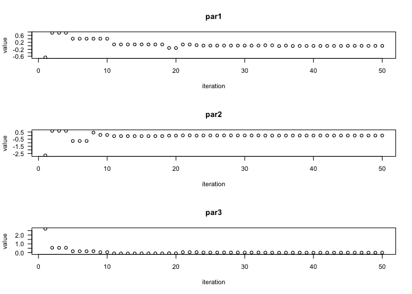<!-- -->

-   **Dixon&Price Function**

``` r
#dixon&price
set.seed(1234)
DEoptim_4 <- DEoptim(d_and_p, lower=c(-10,-10,-10), upper=c(10,10, 10),
                     DEoptim.control(NP=40, itermax=50, trace = FALSE))
#plot of the optimization process for dixon&price function
plot(DEoptim_4)
```
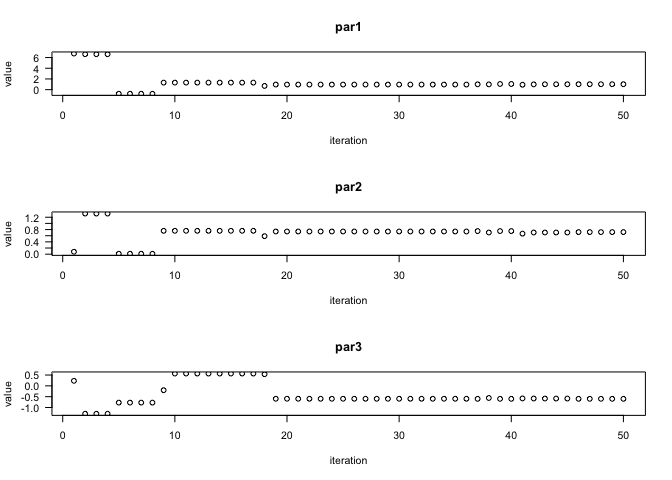<!-- -->

#### Why DEoptim ?

-   **DEoptim** performs function evaluations repeatedly to reach at
    better function/parameter values with each iteration.

-   The evalations can be performed at faster rate by running the
    package in parallel mode.

-   Output can be visualised easily using the plot method which makes it
    easy to read and understand. Also the maximum number of iterations
    to be performed can be changed according to the problem.

-   If the function evaluates to **NA** or **NaN** value for any set of
    parameter then DEoptim stops iterating further. Although the issue
    can be resolved by defining our function in such a way that it
    returns Inf in place of NA.

------------------------------------------------------------------------

### 2. ABCoptim

``` r
require(ABCoptim)
```

    ## Loading required package: ABCoptim

#### Optimising above function using ABCoptim package.

-   **Rosenbrock Function**

``` r
#Rosenbrock
ABCoptim_1 <- abc_optim(c(1,2,3), Rosenbrock, lb=-10, ub=10, criter=50, maxCycle=200)
print(ABCoptim_1)
```

    ## 
    ##  An object of class -abc_answer- (Artificial Bee Colony Optim.):
    ##  par:
    ##     x[1]:  1.017795
    ##     x[2]:  1.032270
    ##     x[3]:  1.073939
    ## 
    ##  value:
    ##            0.009666
    ## 
    ##  counts:
    ##            119

``` r
plot(ABCoptim_1, main="Rosenbrock")
```

<!-- -->

-   **Sphere Function**

``` r
#sphere
ABCoptim_2 <- abc_optim(c(1,2,3), sphere, lb=-10, ub=10, criter=50)
plot(ABCoptim_2, main="Sphere")
```

<!-- -->

-   **Sum Square Function**

``` r
#sum_square
ABCoptim_3 <- abc_optim(c(1,2,3), sum_sq, lb=-10, ub=10, criter=50)
plot(ABCoptim_3, main="Sum Sqaure")
```

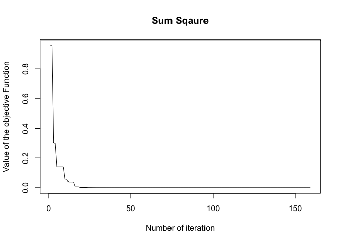<!-- -->

-   **Dixon&price Function**

``` r
#dixon&price
ABCoptim_4 <- abc_optim(c(1,2,3), d_and_p, FoodNumber = 50, lb=-10, ub=10, criter=50)
plot(ABCoptim_4, main="Dixon&Price")
```

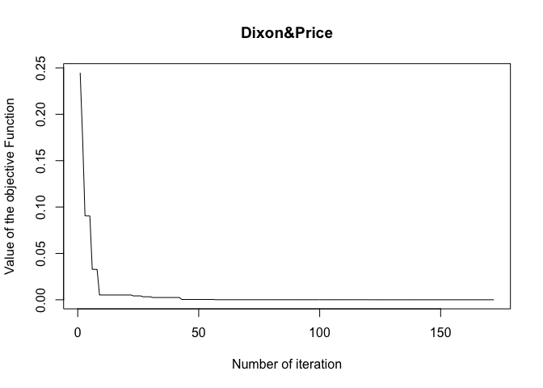<!-- -->

#### Why ABCoptim ?

-   **abc_optim** is an implementation of **ABC optimization
    algorithm**. The optimization can be done within less number of
    iteration if we increase the FoodNumber( i.e. number of food sources
    ).

-   The package also provides **abc_cpp** method which is a C++
    implementation of the algorithm and is much more faster then
    apc_optim.

-   Like DEoptim, ABCoptim also provides plot method which makes it easy
    to visualize the optimization process.

------------------------------------------------------------------------

### 3. Rgenoud

``` r
require(rgenoud)
```

    ## Loading required package: rgenoud

    ## ##  rgenoud (Version 5.8-3.0, Build Date: 2019-01-22)
    ## ##  See http://sekhon.berkeley.edu/rgenoud for additional documentation.
    ## ##  Please cite software as:
    ## ##   Walter Mebane, Jr. and Jasjeet S. Sekhon. 2011.
    ## ##   ``Genetic Optimization Using Derivatives: The rgenoud package for R.''
    ## ##   Journal of Statistical Software, 42(11): 1-26. 
    ## ##

#### Optimising above function using rgenoud package.

-   **Rosenbrock Function**

``` r
#Rosenbrock
genoud_1 <- genoud(fn=Rosenbrock, pop.size=2000, nvars=4, starting.values=matrix(1:4, ncol=4), wait.generation=20, print.level=0 )
genoud_1
```

    ## $value
    ## [1] 9.338559e-08
    ## 
    ## $par
    ## [1] 0.9999329 0.9998665 0.9997336 0.9994673
    ## 
    ## $gradients
    ## [1] -4.001018e-04 -3.997974e-04 -3.997097e-04 -1.029086e-07
    ## 
    ## $generations
    ## [1] 22
    ## 
    ## $peakgeneration
    ## [1] 1
    ## 
    ## $popsize
    ## [1] 2000
    ## 
    ## $operators
    ## [1] 249 250 250 250 250 250 250 250   0

-   **Sphere Function**

``` r
#sphere
genoud_2 <- genoud(fn=sphere, pop.size=2000, nvars=4, starting.values=matrix(1:4, ncol=4), wait.generation=20, print.level=0)
genoud_2
```

    ## $value
    ## [1] 3.822482e-31
    ## 
    ## $par
    ## [1] -4.063599e-16 -3.493849e-16  1.554155e-16 -2.662632e-16
    ## 
    ## $gradients
    ## [1] -8.127210e-16 -6.987683e-16  3.108307e-16 -5.325268e-16
    ## 
    ## $generations
    ## [1] 22
    ## 
    ## $peakgeneration
    ## [1] 1
    ## 
    ## $popsize
    ## [1] 2000
    ## 
    ## $operators
    ## [1] 249 250 250 250 250 250 250 250   0

-   **Sum Square Function**

``` r
#sum_square
genoud_3 <- genoud(fn=sum_sq, pop.size=2000, nvars=4, starting.values=matrix(1:4, ncol=4), wait.generation=20, print.level=0)
genoud_3
```

    ## $value
    ## [1] 4.056231e-32
    ## 
    ## $par
    ## [1] -1.953432e-16 -9.352409e-20  9.625583e-19  2.449771e-17
    ## 
    ## $gradients
    ## [1] -3.906858e-16 -3.722313e-19  5.774522e-18  1.959856e-16
    ## 
    ## $generations
    ## [1] 22
    ## 
    ## $peakgeneration
    ## [1] 1
    ## 
    ## $popsize
    ## [1] 2000
    ## 
    ## $operators
    ## [1] 249 250 250 250 250 250 250 250   0

-   **Dixon&price Function**

``` r
#dixon&price
genoud_4 <- genoud(fn=d_and_p, pop.size=2000, nvars=4,starting.values=matrix(1:4, ncol=4), wait.generation=20, print.level=0 )
genoud_4
```

    ## $value
    ## [1] 7.926027e-11
    ## 
    ## $par
    ## [1] 0.9999945 0.7071042 0.5946011 0.5452521
    ## 
    ## $gradients
    ## [1] -3.285809e-06 -1.818542e-06 -3.596430e-05 -2.520846e-05
    ## 
    ## $generations
    ## [1] 22
    ## 
    ## $peakgeneration
    ## [1] 1
    ## 
    ## $popsize
    ## [1] 2000
    ## 
    ## $operators
    ## [1] 249 250 250 250 250 250 250 250   0

#### Why rgenoud?

-   **rgenoud** provides **genoud** function that works on evolutionary
    algorithm. The function provides a wide range of arguments to
    monitor the optimization process. And compared to derivative based
    optimization methods, **genoud** is much more effective.

-   **genoud** function even works for problems for which the derivative
    information does not exist.

-   The function allows users to set arguments such as **pop.size**(i.e
    initial population size that the function will use for implementing
    evolutionary algorithm), **max.generation** and
    **wait.generation**(i.e limit on the number of generation that would
    take place while execution of evolutionary algorithm) so that
    optimization results in more accurate solution.

------------------------------------------------------------------------

### 4. Genalg

``` r
#loading package genalg
require(genalg)
```

    ## Loading required package: genalg

#### Optimising Rosenbrock function using genalg package.

``` r
#function to display the progress of the optimisation process.
monitor <- function(obj) {
     # plot the population
     xlim = c(obj$stringMin[1], obj$stringMax[1]);
     ylim = c(obj$stringMin[2], obj$stringMax[2]);
     iteration_num = obj$iter
     lbl = paste("Iteration Number: ", obj$iter);
     if(((iteration_num)%%10)==1 || iteration_num==100){
       plot(obj$population, xlim=xlim, ylim=ylim,
          xlab="x", ylab="y", main=lbl);
     }
}

#Optimising Rosenbrock Function 
rbga.results1 = rbga(c(-10, -10), c(10, 10), monitorFunc=monitor, evalFunc=Rosenbrock, mutationChance=0.001)
```

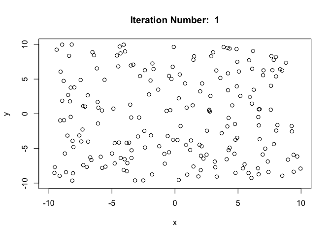<!-- -->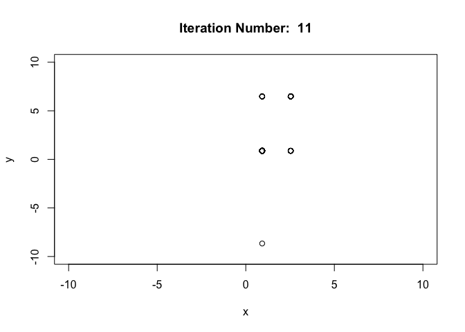<!-- --><!-- -->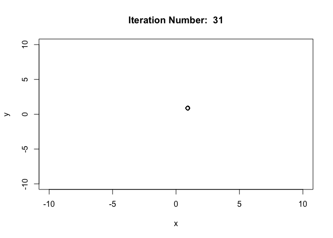<!-- --><!-- --><!-- -->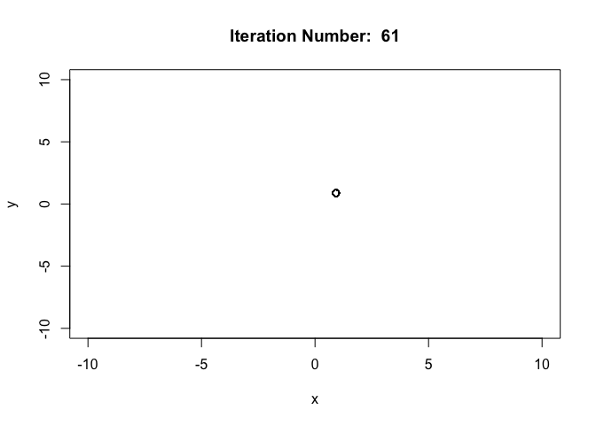<!-- -->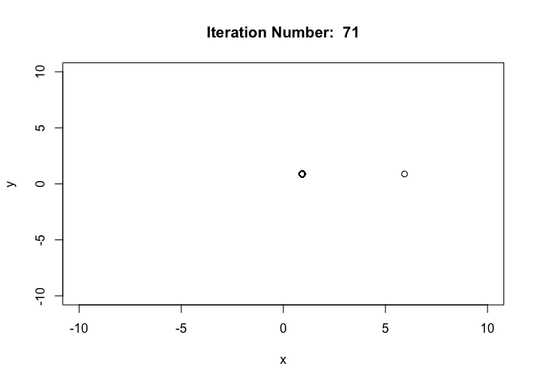<!-- --><!-- --><!-- -->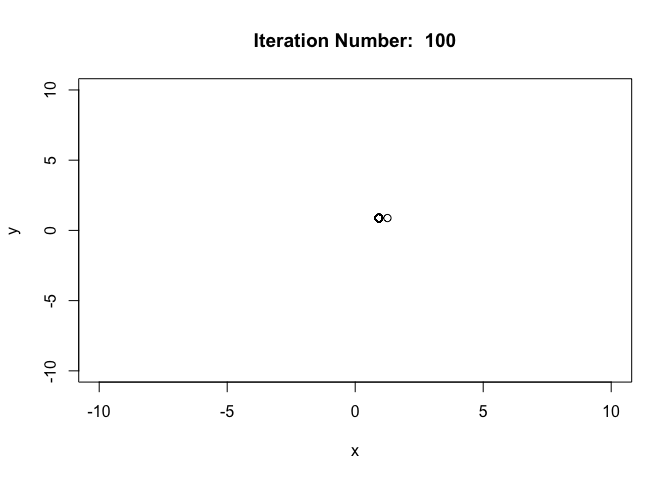<!-- -->
#### Why genalg?

-   **genalg** is an optimization package which is based on genetic
    algorithm. It provides **rbga** function for the optimization
    purpose. We can set different parameters such as **mutationChance**,
    **popSize**, **suggestions** and **iters** according to the need of
    the problem to be optimised.

-   genalg package has a plot function also which can be used to
    visualize the optimization process.

-   In addition to the above specified parameters, rbga also allows
    users to monitor the optimization process as it progresses by
    providing a monitor function to the parameter **monitorFunc**. As in
    the above R code I have provided a monitor function which plots the
    population after every (10\*x + 1)th iteration of the optimization.

-   Also it can be seen from above plots that optimization using rbga
    function is quite effective. That is the optimized populations were
    obtained within less number of iterations and are accurate also.
    This is because the parameter mutationChance is very low which
    implies that convergence would be achieved faster.

------------------------------------------------------------------------

### 4. GenSA

``` r
#loading package GenSA
require("GenSA")
```

    ## Loading required package: GenSA

#### Optimising some newly defined complex function( Griewank, Rastrigin) using GenSA package.

``` r
#using search domains defined over "Go Test Problem" problems list is created to minimise code writing 
problems <- list( name = c("Griewank", "Rastrigin", "Rosenbrock"), 
                  functions = c(Griewank, Rastrigin, Rosenbrock), 
                  lower= c(-600, -5.12, -5), upper=c(600, 5.12, 10) )
for(i in 1:3){
  #print the problem name.
  print((problems$name[[i]]))
  out<- GenSA( lower = rep(problems$lower[[i]], 4), upper = rep(problems$upper[[i]], 4), 
               fn = problems$functions[[i]], control=list(max.time=2) ) #max.time is in seconds
  print(out$value)
  print(out$par)
  cat("\n")
}
```

    ## [1] "Griewank"
    ## [1] 0
    ## [1]  3.638532e-13 -5.664122e-11  5.273073e-11  2.047398e-11
    ## 
    ## [1] "Rastrigin"
    ## [1] 0
    ## [1]  2.445615e-12  3.154495e-12 -4.343148e-11 -3.512043e-12
    ## 
    ## [1] "Rosenbrock"
    ## [1] 1.823776e-19
    ## [1] 1 1 1 1

#### Why GenSA?

-   **GenSA** provides **GenSA** function to optimize complex problems
    such as those having lot of local optimas defined. It is also
    preferable to use when parameter( provide to the problem to be
    optimised ) size is large enough.

-   GenSA is able to find the solutions very quickly also like every
    other solver it provides the **control** argument that can be used
    to control the optimization process. Users are required to pass a
    list of of arguments that are **maxit**, **threshold.stop**,
    **smooth**, **max.time**, etc. to the **control** according to the
    need of the problem. For example if the problem is simple( like
    Rosenbrok ) then we can set **max.time**, **maxit** to low values
    and if we know the optimised value of the problem beforehand and
    want to find the optimized parameters values then we can set
    **threshold.stop** to the known value.

------------------------------------------------------------------------

## Task5

Prepare R code for the volcano function of two parameters b=c(x,y) that
is defined as f(d) = (10 - 0.5(d)) + sin(2\*d) where d is the square
norm distance from x=1, y=5. What are the likely issues in minimizing
this function over the two dimensions? A \[3D\] perspective plot may
help you. Do solvers have trouble getting sensible results for this
function?

``` r
volcano<-function(x){
  x <- matrix(x, ncol=2)
  d<-apply(x,1,function(y){ (y[1]-1)^2 + (y[2]-5)^2 })
  ans<-((10 - 0.5*d) + sin(2*d))
  ans
}

x <- seq(-1, 1, length = 101)
y <- seq(-1, 1, length = 101)
X <- as.matrix(expand.grid(x,y))
colnames(X) <- c("x", "y")

a <- seq(-10, 10, length = 101)
b <- seq(-10, 10, length = 101)
I <- as.matrix(expand.grid(a,b))
colnames(I) <- c("a", "b")

# evaluate function
z <- volcano(X)
c <- volcano(I)

df <- data.frame(X, z)
df1 <- data.frame(I, c)

# plot the function
library(lattice)

#plot volcano function for first set of data X
wireframe(z ~ x * y , data=df, main = "Plot of volcano function", shade = TRUE, scales = list(arrows = FALSE), screen = list(z = -50, x = -70))
```

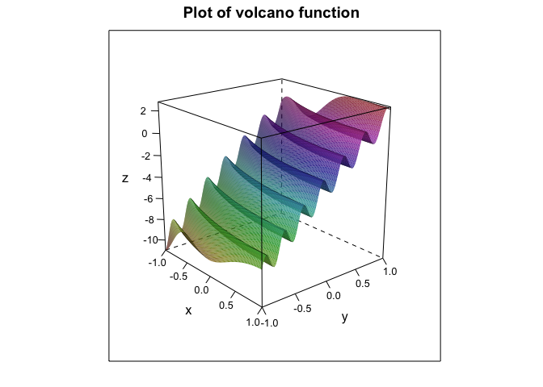<!-- -->

``` r
#plot volcano function for first set of data X1
wireframe(c ~ a * b , data=df1, main = "Plot of volcano function", shade = TRUE, scales = list(arrows = FALSE), screen = list(z = -50, x = -70))
```

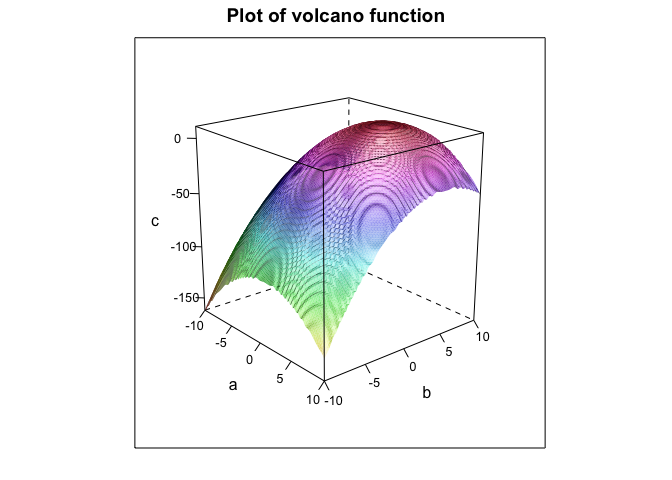<!-- -->

#### Trying to Optimise Volcano Function using opm.

``` r
#using opm solvers for volcano function
result1<-opm(c(0,0), volcano, method=c("L-BFGS-B", "Nelder-Mead", "CG", "Rcgmin", "Rvmmin","BFGS"), control=list(kkt=FALSE, trace=0))
result1
```

    ##                        p1            p2         value fevals gevals convergence
    ## L-BFGS-B    -1.935518e-01 -9.678714e-01 -9.488273e+00     13     13           0
    ## Nelder-Mead -6.297067e-02  1.684581e-01 -3.205087e+00     45     NA           0
    ## CG           3.851191e+13 -1.094680e+14 -6.733210e+27     67     31           0
    ## Rcgmin       0.000000e+00  0.000000e+00 -2.013372e+00      1      1           0
    ## Rvmmin       0.000000e+00  0.000000e+00 -2.013372e+00      1      1           2
    ## BFGS        -1.639873e+00 -8.213043e+00 -8.174490e+01     15      6           0
    ##             kkt1 kkt2 xtime
    ## L-BFGS-B      NA   NA 0.001
    ## Nelder-Mead   NA   NA 0.002
    ## CG            NA   NA 0.004
    ## Rcgmin        NA   NA 0.000
    ## Rvmmin        NA   NA 0.000
    ## BFGS          NA   NA 0.001

#### Checking the above obtained results.

The plot displays that volcano function has various crests and troughs
and it obtains its global minimum value at infinite. Opm solvers are
giving convergence code as 0. So we will check whether the obtained
results are actually minima or not using higher derivative test. Which
says


0 \ and\ A>0 ">
  
``` r
#
volcano.double_diff <- function(x){
  d<- ((x[1]-1)^2 + (x[2]-5)^2) 
  A <- -1 - 16*((x[1]-1)^2)*sin(2*d) + 4*cos(2*d)
  B <- (-16)*(x[1]-1)*(x[2]-5)*sin(2*d)
  C <- -1 - 16*((x[2]-5)^2)*sin(2*d) + 4*cos(2*d)
  c(A, B, C)
}
for(i in 1:6){
  
  #extracting the optimized values of the parameters from opm results.
  tol <- 1e-3
  solver <- rownames(result1)[i]
  a <- result1$p1[[i]]
  b <- result1$p2[[i]]
  
  #evaluating the value of volcano function in the neighborhood of obtained values.
  value <- volcano(c(a, b))
  
  # apply higher derivative test to conclude whether point (a,b) is actually a point of minima
  dif <- volcano.double_diff(c(a,b))
  if( dif[1]>0 && (dif[1]*dif[3]-(dif[2]^2)) > 0 ){
    output <- paste(solver, ": The obtained value=", value," of volcano function at x=", a,
                    " and y=", b, " is minima")
    print(output)
  }
  else{
    output <- paste(solver, ": The obtained value=", value," of volcano function at x=", a,
                    " and y=", b, " is not minima")
    print(output)
  } 
} 
```

    ## [1] "L-BFGS-B : The obtained value= -9.48827274017103  of volcano function at x= -0.193551837814018  and y= -0.967871449040369  is minima"
    ## [1] "Nelder-Mead : The obtained value= -3.20508743218824  of volcano function at x= -0.0629706742241979  and y= 0.168458115123212  is minima"
    ## [1] "CG : The obtained value= -6.73321044952853e+27  of volcano function at x= 38511908010008.8  and y= -109468049404768  is not minima"
    ## [1] "Rcgmin : The obtained value= -2.01337240795951  of volcano function at x= 0  and y= 0  is not minima"
    ## [1] "Rvmmin : The obtained value= -2.01337240795951  of volcano function at x= 0  and y= 0  is not minima"
    ## [1] "BFGS : The obtained value= -81.7449037428911  of volcano function at x= -1.63987282256033  and y= -8.21304323434398  is minima"

-   Higher Derivative test shows that **L-BFGS-b**, **Nelder-Mead**,
    **BFGS** are obtaining the local minimums of volcano function while
    **CG**, **Rcgmin**, **Rvmmin** are not. This might be because the
    solvers uses first order derivatives but first order derivative is
    sometimes not enough to predict whether the point is maxima, minima
    or a saddle point for the function.

#### Trying to Optimise Volcano Function using DEoptim

``` r
set.seed(111)
result1 <- DEoptim(volcano, lower=c(-10,-10), upper=c(10,10), 
                   DEoptim.control(NP=20, itermax=50, trace = FALSE))
plot(result1)
```

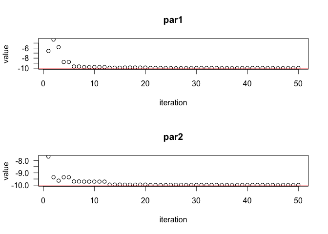<!-- -->

#### Trying to Optimise Volcano Function using genalg

``` r
#using rbga function of genalg with monitorFunc as similar defined earlier
results2 = rbga(c(-10, -10), c(10, 10), monitorFunc=monitor,
                evalFunc=volcano, mutationChance=0.001, iters=40)
```

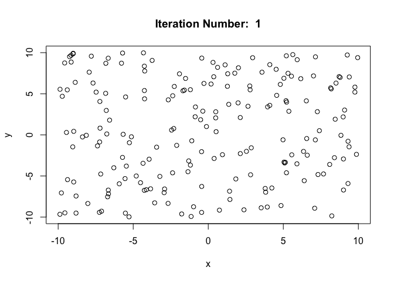<!-- -->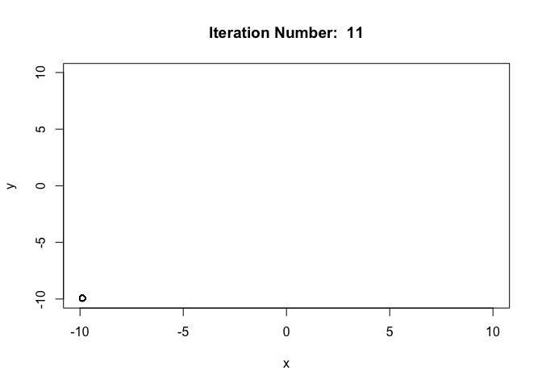<!-- --><!-- -->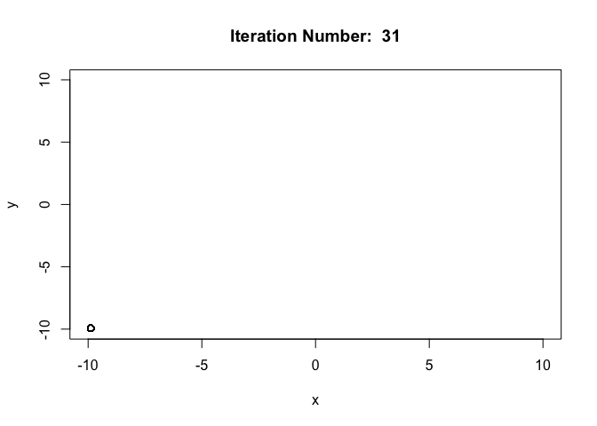<!-- -->

#### Trying to Optimise Volcano Function using GenSA

``` r
result3<- GenSA( lower = rep(-10, 2), upper = rep(10, 2), 
                fn = volcano, control=list(max.time=2) )
print(result3$value)
```

    ## [1] -163.4263

``` r
print(result3$par)
```

    ## [1] -9.965395 -9.989204

#### Trying to Optimise Volcano Function using Rgenoud

``` r
result4 <- genoud(fn=volcano, pop.size=2000, nvars=2, wait.generation=20, print.level=0 )
```

    ## Warning in genoud(fn = volcano, pop.size = 2000, nvars = 2, wait.generation =
    ## 20, : BFGS hit on best individual produced Out of Boundary individual.

    ## Warning in genoud(fn = volcano, pop.size = 2000, nvars = 2, wait.generation =
    ## 20, : BFGS hit on best individual produced Out of Boundary individual.

``` r
result4
```

    ## $value
    ## [1] -2.455291e+27
    ## 
    ## $par
    ## [1] -4.949399e+13 -4.960773e+13
    ## 
    ## $gradients
    ## [1] 0 0
    ## 
    ## $generations
    ## [1] 23
    ## 
    ## $peakgeneration
    ## [1] 2
    ## 
    ## $popsize
    ## [1] 2000
    ## 
    ## $operators
    ## [1] 249 250 250 250 250 250 250 250   0

#### Issues while optimizing Volcano function.

-   The plot indicates that the function has **large number of local
    minimums** and it acquires its **global minimum value at infinite**.
    Optimization of such functions might give wrong solutions as it is
    giving with different **opm** solvers( although the convergence code
    is 0- reson discussed above ). Also most of the optimization solvers
    in R requires boundaries to be defined for the parameters, and for
    the volcano function choosing a boundary is not much convenient.

-   Adding to the boundary point, it is expected that for volcano
    function the global minimum should occur at the boundary if we
    provide the boundary to the solvers requiring boundary conditions.
    Also it is expected from the **solvers based of genetic
    algorithms**( such as **DEoptim**, **GenSA** and **genalg** ) to
    obtain the **global optimum** instead of local minimums effectively.
    And **DEoptim**, **GenSA** and **genalg** are providing the expected
    results in this case.

-   The solver **genoud** is providing the results out of the boundary.
    But this is expected as we know that whatever boundary we choose( or
    default boundary the solver take if not provided ) there always
    exist values of the function that are less than the values a t
    boundary outside the boundary. Although we can set the argument
    **boundary.enforcement** accordingly to avoid such situations.

-   Some of the solvers(**ABCoptim**) tend to assign **NA/NaN** value to
    the parameter “x”(passed to volcano function) during the
    optimization process which results in **Warning: NA/NaN function
    evaluation** and they keep on producing the same warning until the
    iteration limit is reached and in the end they provide a wrong
    solution.
