StochOptim: A R Wrapper for stochastic Optimisation
================

## Test 1

Prepare R code for three of the unconstrained test functions in [GO Test
Problems](http://www-optima.amp.i.kyoto-u.ac.jp/member/student/hedar/Hedar_files/TestGO.htm)
that allow dimension greater than 4

-   **Rosenbrock Function**

``` r
Rosenbrock<-function(x){
  len<-length(x)
  sum((100*(x[-len]^2-x[-1])^2) + (x[-len]-rep(1, len-1))^2)
}

#gradient function for Rosenbrock function
Rosenbrock.g<-function(x){
  len<-length(x)
  g<-rep(NA, len)
  g[1]<- 2*(x[1]-1) + 400*x[1]*(x[1]^2-x[2])
  g[2:(len-1)] <- 2*(x[2:(len-1)]-1) + 400*x[2:(len-1)]*(x[2:(len-1)]^2-x[2:(len-1) + 1]) + 200*(x[2:(len-1)]-x[2:(len-1) - 1]^2)
  g[len] <- 200 * (x[len] - x[len - 1]^2)
  g
}
Rosenbrock(c(1,2,3,4))
```

    ## [1] 2705

-   **Sphere Function**

``` r
sphere<-function(x){
  sp<-sum(x^2)
  if(is.na(sp)){
    sp<-Inf
  } 
  sp
}

#gradient function for sphere function
sphere.g<-function(x){
  len<-length(x)
  g<-rep(NA, len)
  g[1:len]<-2*x
  g
}

sphere(c(1,2,3,4))
```

    ## [1] 30

-   **Sum Squares Function**

``` r
sum_sq<-function(x){
  len<-length(x)
  ans <- sum(seq(1, len, length=len)*(x^2))
  if(is.na(ans)) ans <- Inf
  ans
}

#gradient function for sum square function
sum_sq.g<-function(x){
  len<-length(x)
  g<-rep(NA, len)
  g[1:len]<-seq(1, len, length=len)*2*x
  g
}

sum_sq(c(1,2,3,4))
```

    ## [1] 100

-   **Dixon&Price Function**

``` r
d_and_p<-function(x){
  len<-length(x)
  t1<-(x[1]-1)^2
  t2<-sum(seq(2, len, length=len-1)*(2*x[-1]^2-x[-len])^2)
  t1+t2
}

#gradient function for dixon&price function
d_and_p.g<-function(x){
  len<-length(x)
  g<-rep(NA, len)
  g[1]<-2*(x[1]-1) - 4*(2*x[2]^2-x[1])
  g[2:(len-1)]<- 8*seq(2,len-1, length=len-2)*x[2:(len-1)]*(2*x[2:(len-1)]^2-x[1:(len-2)]) - 2*seq(3,len, length=len-2)*(2*x[3:len]^2-x[2:(len-1)])
  g[len]<-8*len*x[len]*(2*x[len]^2-x[len-1])
  g
}
d_and_p(c(1,2,3,4))
```

    ## [1] 4230

## Test 2

Try to minimize these with the base R **optim()** function. Be sure to
document what you do.

``` r
#Rosenbrock
optm_1<-optim(c(1,2,3,4), Rosenbrock, Rosenbrock.g, method="BFGS")
optm_1
```

    ## $par
    ## [1] 1 1 1 1
    ## 
    ## $value
    ## [1] 5.676878e-17
    ## 
    ## $counts
    ## function gradient 
    ##       99       37 
    ## 
    ## $convergence
    ## [1] 0
    ## 
    ## $message
    ## NULL

``` r
#sphere
optm_2<-optim(c(1,2,3,4), sphere, sphere.g, method="CG")
optm_2
```

    ## $par
    ## [1] 2.204415e-07 4.408831e-07 6.613246e-07 8.817661e-07
    ## 
    ## $value
    ## [1] 1.457834e-12
    ## 
    ## $counts
    ## function gradient 
    ##       15        8 
    ## 
    ## $convergence
    ## [1] 0
    ## 
    ## $message
    ## NULL

``` r
#Sum square
optm_3<-optim(c(1,2,3,4), sum_sq, method="SANN")
optm_3
```

    ## $par
    ## [1]  0.03332764 -0.05306280  0.04734184  0.01764977
    ## 
    ## $value
    ## [1] 0.01471186
    ## 
    ## $counts
    ## function gradient 
    ##    10000       NA 
    ## 
    ## $convergence
    ## [1] 0
    ## 
    ## $message
    ## NULL

``` r
#dixon&price
optm_4<-optim(c(1,2,3,4), d_and_p, method="Nelder-Mead")
optm_4
```

    ## $par
    ## [1]  0.9999534  0.7081443  0.5953718 -0.5449882
    ## 
    ## $value
    ## [1] 2.694426e-05
    ## 
    ## $counts
    ## function gradient 
    ##      295       NA 
    ## 
    ## $convergence
    ## [1] 0
    ## 
    ## $message
    ## NULL

## Test 3

Run several (at least 4) solvers at once with the **opm()** function

``` r
require(optimr)
```

    ## Loading required package: optimr

``` r
#Rosenbrock
result1<-opm(c(1,2,3,4), Rosenbrock, Rosenbrock.g, method="ALL", control=list(kkt=FALSE, trace=0))
result1
```

    ##                    p1        p2        p3        p4        value fevals gevals
    ## BFGS        1.0000000 1.0000000 1.0000000 1.0000000 5.676878e-17     99     37
    ## CG          1.1117180 1.2374887 1.5330875 2.3535077 3.534559e-01   3298   1001
    ## Nelder-Mead 0.9999500 0.9995963 0.9987679 0.9973660 3.189882e-05    513     NA
    ## L-BFGS-B    0.9999997 0.9999995 0.9999990 0.9999984 1.207693e-11     43     43
    ## nlm         1.0000000 1.0000000 0.9999999 0.9999999 7.364247e-14     NA     79
    ## nlminb      1.0000000 1.0000000 1.0000000 1.0000000 1.887858e-16     54     40
    ## Rcgmin      1.0000001 1.0000002 1.0000003 1.0000006 1.316622e-13    137     63
    ## Rvmmin      1.0000000 1.0000000 1.0000000 1.0000000 3.722437e-30     65     44
    ## hjn         1.0000006 1.0000012 1.0000024 1.0000047 8.483011e-12   3500     NA
    ##             convergence kkt1 kkt2 xtime
    ## BFGS                  0   NA   NA 0.002
    ## CG                    1   NA   NA 0.016
    ## Nelder-Mead           0   NA   NA 0.002
    ## L-BFGS-B              0   NA   NA 0.001
    ## nlm                   0   NA   NA 0.001
    ## nlminb                0   NA   NA 0.001
    ## Rcgmin                0   NA   NA 0.003
    ## Rvmmin                0   NA   NA 0.004
    ## hjn                   0   NA   NA 0.019

``` r
#sphere
result2<-opm(c(1,2,3,4), sphere, sphere.g, method="ALL", control=list(kkt=FALSE, trace=0))
result2
```

    ##                         p1             p2             p3             p4
    ## BFGS         -2.183439e-16  -4.366877e-16   1.221245e-16   3.700743e-16
    ## CG            2.204415e-07   4.408831e-07   6.613246e-07   8.817661e-07
    ## Nelder-Mead  -1.261488e-04   4.478612e-04   9.807649e-05   1.402697e-04
    ## L-BFGS-B     -9.860761e-32  -1.972152e-31  -3.944305e-31  -3.944305e-31
    ## nlm           0.000000e+00   0.000000e+00   0.000000e+00   0.000000e+00
    ## nlminb       3.133255e-167 -1.348723e-167 -1.184606e-167  2.739049e-167
    ## Rcgmin       -6.661338e-16  -1.332268e-15  -1.776357e-15  -2.664535e-15
    ## Rvmmin        1.110223e-16   2.220446e-16  -2.220446e-16  -4.440892e-16
    ## hjn           0.000000e+00   0.000000e+00   0.000000e+00   0.000000e+00
    ##                    value fevals gevals convergence kkt1 kkt2 xtime
    ## BFGS        2.179639e-30      5      3           0   NA   NA 0.000
    ## CG          1.457834e-12     15      8           0   NA   NA 0.000
    ## Nelder-Mead 2.457878e-07    207     NA           0   NA   NA 0.001
    ## L-BFGS-B    3.597681e-61      4      4           0   NA   NA 0.000
    ## nlm         0.000000e+00     NA      1           0   NA   NA 0.000
    ## nlminb      0.000000e+00     30     27           0   NA   NA 0.000
    ## Rcgmin      1.247386e-29      4      2           0   NA   NA 0.001
    ## Rvmmin      3.081488e-31      4      3           2   NA   NA 0.000
    ## hjn         0.000000e+00    128     NA           0   NA   NA 0.000

``` r
#sum_square
result3<-opm(c(1,2,3,4), sum_sq, sum_sq.g, method="ALL", control=list(kkt=FALSE, trace=0))
result3
```

    ##                         p1             p2             p3             p4
    ## BFGS         -1.941783e-14  -3.049467e-13  -1.766722e-12   7.956968e-13
    ## CG            5.703672e-07  -7.784541e-08   4.351182e-08   9.908794e-08
    ## Nelder-Mead  -5.818810e-04   3.955017e-05   3.673549e-05  -2.442033e-04
    ## L-BFGS-B      1.892986e-07   3.767959e-06   2.396254e-06   5.000826e-06
    ## nlm           1.623039e-07   4.749345e-08   1.428741e-08  -1.450018e-08
    ## nlminb       3.201704e-168 -5.247493e-169  2.560660e-168 -1.200510e-168
    ## Rcgmin       -2.775558e-17  -1.387779e-17  -1.734723e-17   1.218643e-16
    ## Rvmmin       -6.706204e-16  -6.761823e-16  -2.509268e-16  -2.508378e-15
    ## hjn           0.000000e+00   0.000000e+00   0.000000e+00   0.000000e+00
    ##                    value fevals gevals convergence kkt1 kkt2 xtime
    ## BFGS        1.208497e-23     37     17           0   NA   NA 0.003
    ## CG          3.823921e-13     51     21           0   NA   NA 0.001
    ## Nelder-Mead 5.843035e-07    165     NA           0   NA   NA 0.002
    ## L-BFGS-B    1.456900e-10     10     10           0   NA   NA 0.000
    ## nlm         3.230721e-14     NA     11           0   NA   NA 0.002
    ## nlminb      0.000000e+00     55     49           0   NA   NA 0.001
    ## Rcgmin      6.146199e-32     10      5           0   NA   NA 0.001
    ## Rvmmin      2.672091e-29     20     16           0   NA   NA 0.001
    ## hjn         0.000000e+00    128     NA           0   NA   NA 0.002

``` r
#dixon&price
result4<-opm(c(1,2,3,4), d_and_p, d_and_p.g, method="ALL", control=list(kkt=FALSE, trace=0))
result4
```

    ##                    p1        p2        p3         p4        value fevals gevals
    ## BFGS        1.0000000 0.7071068 0.5946036 -0.5452539 3.899315e-20     57     26
    ## CG          0.9999991 0.7071064 0.5946033 -0.5452537 9.031343e-13    150     55
    ## Nelder-Mead 0.9999534 0.7081443 0.5953718 -0.5449882 2.694426e-05    295     NA
    ## L-BFGS-B    0.9999982 0.7071062 0.5946031  0.5452535 4.912154e-12     23     23
    ## nlm         0.9999999 0.7071068 0.5946035 -0.5452538 9.342096e-14     NA     31
    ## nlminb      1.0000000 0.7071068 0.5946036  0.5452539 6.132918e-22     20     18
    ## Rcgmin      1.0000000 0.7071068 0.5946036  0.5452539 1.338168e-15     48     25
    ## Rvmmin      1.0000000 0.7071068 0.5946036 -0.5452539 3.821045e-29     37     27
    ## hjn         1.0000001 0.7071068 0.5946036  0.5452539 5.463278e-14    660     NA
    ##             convergence kkt1 kkt2 xtime
    ## BFGS                  0   NA   NA 0.017
    ## CG                    0   NA   NA 0.003
    ## Nelder-Mead           0   NA   NA 0.003
    ## L-BFGS-B              0   NA   NA 0.001
    ## nlm                   0   NA   NA 0.002
    ## nlminb                0   NA   NA 0.001
    ## Rcgmin                0   NA   NA 0.002
    ## Rvmmin                0   NA   NA 0.002
    ## hjn                   0   NA   NA 0.010

#### Observations from above Result

-   For problems which has quite significant scaling factor(Eg:
    Rosenbrock function), non-gradient methods such as **Nelder-Mead**
    and **hjn** does large function evaluations to arrive at results.

-   For simpler problems such as Sphere function, **Nelder-Mead** and
    **hjn** requires relatively less number of evaluations as compared
    to Rosenbrock problem but still, the number of evaluations involved
    is larger than compared to gradient optimization methods for the
    same problem.

-   **CG** method reaches its iteration limit and does not able to find
    the minimum for the Rosenbrock function. Also it can be seen that
    this method takes relatively more function and gradient computations
    compared to other gradient methods.

-   **Rvmmin** method achieves better results compared to other methods
    and for the Rosenbrock problem **Rvmmin** comes up with the best
    accuracy.

-   **BFGS**, **L-BFGS-B** and **Rcgmin** are obtaining good results
    with less number of computations involved.

-   **nlminb** sometimes provide **NA/NaN** value as parameter “x” to
    the function(**Sphere**, **Sum Square**) during the optimization
    process. Also it should be noted that nlminb is obtaining much
    closer values of parameters to the exact solution as compared to the
    parameter values obtained by other solvers.

#### Conlusion

-   For the purpose of achieving better results we can use **L-BFGS-B**,
    **Rvmmin**,**nlminb**, **BFGS** and **Rcgmin** by providing analytic
    gradient to these methods. It could happen that **nlminb** might
    provide **NA** values as parameters to the objective function but
    this could be handled separately by defining our objective functon
    such that it output Inf in place of NA.
-   As **Nelder-Mead** and **hjn** do quite large number of function
    evaluations to arrive at results so we should not use them for
    optimizing difficult problems because they might hit the limit of
    function evaluations in such case.

## Test 4

Choose at least three stochastic optimization solvers from the
suggestions in Global and Stochastic Optimization section of the [CRAN
Task View: Optimization and Mathematical
Programming](https://cran.r-project.org/web/views/Optimization.html) and
apply these to your test problems.

------------------------------------------------------------------------

### 1. DEoptim

``` r
require(DEoptim)
```

    ## Loading required package: DEoptim

    ## Loading required package: parallel

    ## 
    ## DEoptim package
    ## Differential Evolution algorithm in R
    ## Authors: D. Ardia, K. Mullen, B. Peterson and J. Ulrich

#### Optimising above function using DEoptim package.

-   **Rosenbrock Function**

``` r
#Rosenbrock
set.seed(1231)
DEoptim_1 <- DEoptim(Rosenbrock, lower=c(-10,-10,-10), upper=c(10,10, 10), DEoptim.control(NP=40))
```

    ## Iteration: 1 bestvalit: 2481.927715 bestmemit:    1.658948    2.623582    1.906027
    ## Iteration: 2 bestvalit: 2481.927715 bestmemit:    1.658948    2.623582    1.906027
    ## Iteration: 3 bestvalit: 948.126917 bestmemit:   -1.536302    2.623582    3.830113
    ## Iteration: 4 bestvalit: 135.612906 bestmemit:   -0.978280    0.255618   -0.839906
    ## Iteration: 5 bestvalit: 135.612906 bestmemit:   -0.978280    0.255618   -0.839906
    ## Iteration: 6 bestvalit: 37.609792 bestmemit:    1.718759    2.398873    5.547106
    ## Iteration: 7 bestvalit: 37.609792 bestmemit:    1.718759    2.398873    5.547106
    ## Iteration: 8 bestvalit: 37.609792 bestmemit:    1.718759    2.398873    5.547106
    ## Iteration: 9 bestvalit: 8.678236 bestmemit:   -1.063658    1.260164    1.423908
    ## Iteration: 10 bestvalit: 8.678236 bestmemit:   -1.063658    1.260164    1.423908
    ## Iteration: 11 bestvalit: 8.678236 bestmemit:   -1.063658    1.260164    1.423908
    ## Iteration: 12 bestvalit: 8.678236 bestmemit:   -1.063658    1.260164    1.423908
    ## Iteration: 13 bestvalit: 8.678236 bestmemit:   -1.063658    1.260164    1.423908
    ## Iteration: 14 bestvalit: 8.678236 bestmemit:   -1.063658    1.260164    1.423908
    ## Iteration: 15 bestvalit: 8.678236 bestmemit:   -1.063658    1.260164    1.423908
    ## Iteration: 16 bestvalit: 8.678236 bestmemit:   -1.063658    1.260164    1.423908
    ## Iteration: 17 bestvalit: 8.678236 bestmemit:   -1.063658    1.260164    1.423908
    ## Iteration: 18 bestvalit: 8.678236 bestmemit:   -1.063658    1.260164    1.423908
    ## Iteration: 19 bestvalit: 6.718138 bestmemit:   -1.257655    1.464847    2.125854
    ## Iteration: 20 bestvalit: 6.718138 bestmemit:   -1.257655    1.464847    2.125854
    ## Iteration: 21 bestvalit: 6.718138 bestmemit:   -1.257655    1.464847    2.125854
    ## Iteration: 22 bestvalit: 6.718138 bestmemit:   -1.257655    1.464847    2.125854
    ## Iteration: 23 bestvalit: 6.718138 bestmemit:   -1.257655    1.464847    2.125854
    ## Iteration: 24 bestvalit: 6.718138 bestmemit:   -1.257655    1.464847    2.125854
    ## Iteration: 25 bestvalit: 2.006947 bestmemit:    0.853712    0.641855    0.516901
    ## Iteration: 26 bestvalit: 2.006947 bestmemit:    0.853712    0.641855    0.516901
    ## Iteration: 27 bestvalit: 2.006947 bestmemit:    0.853712    0.641855    0.516901
    ## Iteration: 28 bestvalit: 2.006947 bestmemit:    0.853712    0.641855    0.516901
    ## Iteration: 29 bestvalit: 2.006947 bestmemit:    0.853712    0.641855    0.516901
    ## Iteration: 30 bestvalit: 2.006947 bestmemit:    0.853712    0.641855    0.516901
    ## Iteration: 31 bestvalit: 1.343195 bestmemit:    0.747050    0.462156    0.187184
    ## Iteration: 32 bestvalit: 1.343195 bestmemit:    0.747050    0.462156    0.187184
    ## Iteration: 33 bestvalit: 1.343195 bestmemit:    0.747050    0.462156    0.187184
    ## Iteration: 34 bestvalit: 1.343195 bestmemit:    0.747050    0.462156    0.187184
    ## Iteration: 35 bestvalit: 0.170336 bestmemit:    0.853712    0.708459    0.516901
    ## Iteration: 36 bestvalit: 0.170336 bestmemit:    0.853712    0.708459    0.516901
    ## Iteration: 37 bestvalit: 0.170336 bestmemit:    0.853712    0.708459    0.516901
    ## Iteration: 38 bestvalit: 0.170336 bestmemit:    0.853712    0.708459    0.516901
    ## Iteration: 39 bestvalit: 0.170336 bestmemit:    0.853712    0.708459    0.516901
    ## Iteration: 40 bestvalit: 0.170336 bestmemit:    0.853712    0.708459    0.516901
    ## Iteration: 41 bestvalit: 0.170336 bestmemit:    0.853712    0.708459    0.516901
    ## Iteration: 42 bestvalit: 0.170336 bestmemit:    0.853712    0.708459    0.516901
    ## Iteration: 43 bestvalit: 0.170336 bestmemit:    0.853712    0.708459    0.516901
    ## Iteration: 44 bestvalit: 0.170336 bestmemit:    0.853712    0.708459    0.516901
    ## Iteration: 45 bestvalit: 0.170336 bestmemit:    0.853712    0.708459    0.516901
    ## Iteration: 46 bestvalit: 0.170336 bestmemit:    0.853712    0.708459    0.516901
    ## Iteration: 47 bestvalit: 0.170336 bestmemit:    0.853712    0.708459    0.516901
    ## Iteration: 48 bestvalit: 0.170336 bestmemit:    0.853712    0.708459    0.516901
    ## Iteration: 49 bestvalit: 0.170336 bestmemit:    0.853712    0.708459    0.516901
    ## Iteration: 50 bestvalit: 0.166176 bestmemit:    0.867191    0.734993    0.562423
    ## Iteration: 51 bestvalit: 0.166176 bestmemit:    0.867191    0.734993    0.562423
    ## Iteration: 52 bestvalit: 0.166176 bestmemit:    0.867191    0.734993    0.562423
    ## Iteration: 53 bestvalit: 0.166176 bestmemit:    0.867191    0.734993    0.562423
    ## Iteration: 54 bestvalit: 0.166176 bestmemit:    0.867191    0.734993    0.562423
    ## Iteration: 55 bestvalit: 0.166176 bestmemit:    0.867191    0.734993    0.562423
    ## Iteration: 56 bestvalit: 0.166176 bestmemit:    0.867191    0.734993    0.562423
    ## Iteration: 57 bestvalit: 0.166176 bestmemit:    0.867191    0.734993    0.562423
    ## Iteration: 58 bestvalit: 0.166176 bestmemit:    0.867191    0.734993    0.562423
    ## Iteration: 59 bestvalit: 0.138056 bestmemit:    0.984691    0.963953    0.892692
    ## Iteration: 60 bestvalit: 0.138056 bestmemit:    0.984691    0.963953    0.892692
    ## Iteration: 61 bestvalit: 0.049780 bestmemit:    0.984691    0.963953    0.907982
    ## Iteration: 62 bestvalit: 0.049780 bestmemit:    0.984691    0.963953    0.907982
    ## Iteration: 63 bestvalit: 0.049780 bestmemit:    0.984691    0.963953    0.907982
    ## Iteration: 64 bestvalit: 0.049780 bestmemit:    0.984691    0.963953    0.907982
    ## Iteration: 65 bestvalit: 0.049780 bestmemit:    0.984691    0.963953    0.907982
    ## Iteration: 66 bestvalit: 0.049780 bestmemit:    0.984691    0.963953    0.907982
    ## Iteration: 67 bestvalit: 0.049780 bestmemit:    0.984691    0.963953    0.907982
    ## Iteration: 68 bestvalit: 0.049780 bestmemit:    0.984691    0.963953    0.907982
    ## Iteration: 69 bestvalit: 0.049780 bestmemit:    0.984691    0.963953    0.907982
    ## Iteration: 70 bestvalit: 0.049780 bestmemit:    0.984691    0.963953    0.907982
    ## Iteration: 71 bestvalit: 0.049780 bestmemit:    0.984691    0.963953    0.907982
    ## Iteration: 72 bestvalit: 0.049780 bestmemit:    0.984691    0.963953    0.907982
    ## Iteration: 73 bestvalit: 0.049780 bestmemit:    0.984691    0.963953    0.907982
    ## Iteration: 74 bestvalit: 0.049780 bestmemit:    0.984691    0.963953    0.907982
    ## Iteration: 75 bestvalit: 0.049780 bestmemit:    0.984691    0.963953    0.907982
    ## Iteration: 76 bestvalit: 0.049780 bestmemit:    0.984691    0.963953    0.907982
    ## Iteration: 77 bestvalit: 0.049780 bestmemit:    0.984691    0.963953    0.907982
    ## Iteration: 78 bestvalit: 0.049780 bestmemit:    0.984691    0.963953    0.907982
    ## Iteration: 79 bestvalit: 0.049780 bestmemit:    0.984691    0.963953    0.907982
    ## Iteration: 80 bestvalit: 0.049780 bestmemit:    0.984691    0.963953    0.907982
    ## Iteration: 81 bestvalit: 0.049780 bestmemit:    0.984691    0.963953    0.907982
    ## Iteration: 82 bestvalit: 0.040250 bestmemit:    1.028039    1.061651    1.108834
    ## Iteration: 83 bestvalit: 0.040250 bestmemit:    1.028039    1.061651    1.108834
    ## Iteration: 84 bestvalit: 0.040250 bestmemit:    1.028039    1.061651    1.108834
    ## Iteration: 85 bestvalit: 0.040250 bestmemit:    1.028039    1.061651    1.108834
    ## Iteration: 86 bestvalit: 0.040250 bestmemit:    1.028039    1.061651    1.108834
    ## Iteration: 87 bestvalit: 0.039916 bestmemit:    0.959361    0.933738    0.859211
    ## Iteration: 88 bestvalit: 0.039916 bestmemit:    0.959361    0.933738    0.859211
    ## Iteration: 89 bestvalit: 0.039916 bestmemit:    0.959361    0.933738    0.859211
    ## Iteration: 90 bestvalit: 0.039916 bestmemit:    0.959361    0.933738    0.859211
    ## Iteration: 91 bestvalit: 0.039916 bestmemit:    0.959361    0.933738    0.859211
    ## Iteration: 92 bestvalit: 0.034441 bestmemit:    0.959361    0.932945    0.859211
    ## Iteration: 93 bestvalit: 0.034441 bestmemit:    0.959361    0.932945    0.859211
    ## Iteration: 94 bestvalit: 0.034441 bestmemit:    0.959361    0.932945    0.859211
    ## Iteration: 95 bestvalit: 0.012149 bestmemit:    0.954729    0.917153    0.840465
    ## Iteration: 96 bestvalit: 0.012149 bestmemit:    0.954729    0.917153    0.840465
    ## Iteration: 97 bestvalit: 0.012149 bestmemit:    0.954729    0.917153    0.840465
    ## Iteration: 98 bestvalit: 0.012149 bestmemit:    0.954729    0.917153    0.840465
    ## Iteration: 99 bestvalit: 0.012149 bestmemit:    0.954729    0.917153    0.840465
    ## Iteration: 100 bestvalit: 0.012149 bestmemit:    0.954729    0.917153    0.840465
    ## Iteration: 101 bestvalit: 0.012149 bestmemit:    0.954729    0.917153    0.840465
    ## Iteration: 102 bestvalit: 0.012149 bestmemit:    0.954729    0.917153    0.840465
    ## Iteration: 103 bestvalit: 0.012149 bestmemit:    0.954729    0.917153    0.840465
    ## Iteration: 104 bestvalit: 0.012149 bestmemit:    0.954729    0.917153    0.840465
    ## Iteration: 105 bestvalit: 0.012149 bestmemit:    0.954729    0.917153    0.840465
    ## Iteration: 106 bestvalit: 0.012149 bestmemit:    0.954729    0.917153    0.840465
    ## Iteration: 107 bestvalit: 0.012149 bestmemit:    0.954729    0.917153    0.840465
    ## Iteration: 108 bestvalit: 0.012149 bestmemit:    0.954729    0.917153    0.840465
    ## Iteration: 109 bestvalit: 0.012149 bestmemit:    0.954729    0.917153    0.840465
    ## Iteration: 110 bestvalit: 0.012149 bestmemit:    0.954729    0.917153    0.840465
    ## Iteration: 111 bestvalit: 0.012149 bestmemit:    0.954729    0.917153    0.840465
    ## Iteration: 112 bestvalit: 0.012149 bestmemit:    0.954729    0.917153    0.840465
    ## Iteration: 113 bestvalit: 0.012149 bestmemit:    0.954729    0.917153    0.840465
    ## Iteration: 114 bestvalit: 0.012149 bestmemit:    0.954729    0.917153    0.840465
    ## Iteration: 115 bestvalit: 0.012149 bestmemit:    0.954729    0.917153    0.840465
    ## Iteration: 116 bestvalit: 0.012149 bestmemit:    0.954729    0.917153    0.840465
    ## Iteration: 117 bestvalit: 0.012149 bestmemit:    0.954729    0.917153    0.840465
    ## Iteration: 118 bestvalit: 0.012149 bestmemit:    0.954729    0.917153    0.840465
    ## Iteration: 119 bestvalit: 0.012149 bestmemit:    0.954729    0.917153    0.840465
    ## Iteration: 120 bestvalit: 0.007258 bestmemit:    1.017592    1.040863    1.078502
    ## Iteration: 121 bestvalit: 0.007258 bestmemit:    1.017592    1.040863    1.078502
    ## Iteration: 122 bestvalit: 0.000214 bestmemit:    1.000219    1.001687    1.002635
    ## Iteration: 123 bestvalit: 0.000214 bestmemit:    1.000219    1.001687    1.002635
    ## Iteration: 124 bestvalit: 0.000214 bestmemit:    1.000219    1.001687    1.002635
    ## Iteration: 125 bestvalit: 0.000214 bestmemit:    1.000219    1.001687    1.002635
    ## Iteration: 126 bestvalit: 0.000214 bestmemit:    1.000219    1.001687    1.002635
    ## Iteration: 127 bestvalit: 0.000214 bestmemit:    1.000219    1.001687    1.002635
    ## Iteration: 128 bestvalit: 0.000214 bestmemit:    1.000219    1.001687    1.002635
    ## Iteration: 129 bestvalit: 0.000214 bestmemit:    1.000219    1.001687    1.002635
    ## Iteration: 130 bestvalit: 0.000214 bestmemit:    1.000219    1.001687    1.002635
    ## Iteration: 131 bestvalit: 0.000214 bestmemit:    1.000219    1.001687    1.002635
    ## Iteration: 132 bestvalit: 0.000214 bestmemit:    1.000219    1.001687    1.002635
    ## Iteration: 133 bestvalit: 0.000214 bestmemit:    1.000219    1.001687    1.002635
    ## Iteration: 134 bestvalit: 0.000214 bestmemit:    1.000219    1.001687    1.002635
    ## Iteration: 135 bestvalit: 0.000214 bestmemit:    1.000219    1.001687    1.002635
    ## Iteration: 136 bestvalit: 0.000214 bestmemit:    1.000219    1.001687    1.002635
    ## Iteration: 137 bestvalit: 0.000214 bestmemit:    1.000219    1.001687    1.002635
    ## Iteration: 138 bestvalit: 0.000214 bestmemit:    1.000219    1.001687    1.002635
    ## Iteration: 139 bestvalit: 0.000214 bestmemit:    1.000219    1.001687    1.002635
    ## Iteration: 140 bestvalit: 0.000214 bestmemit:    1.000219    1.001687    1.002635
    ## Iteration: 141 bestvalit: 0.000214 bestmemit:    1.000219    1.001687    1.002635
    ## Iteration: 142 bestvalit: 0.000214 bestmemit:    1.000219    1.001687    1.002635
    ## Iteration: 143 bestvalit: 0.000214 bestmemit:    1.000219    1.001687    1.002635
    ## Iteration: 144 bestvalit: 0.000214 bestmemit:    1.000219    1.001687    1.002635
    ## Iteration: 145 bestvalit: 0.000214 bestmemit:    1.000219    1.001687    1.002635
    ## Iteration: 146 bestvalit: 0.000214 bestmemit:    1.000219    1.001687    1.002635
    ## Iteration: 147 bestvalit: 0.000214 bestmemit:    1.000219    1.001687    1.002635
    ## Iteration: 148 bestvalit: 0.000214 bestmemit:    1.000219    1.001687    1.002635
    ## Iteration: 149 bestvalit: 0.000214 bestmemit:    1.000219    1.001687    1.002635
    ## Iteration: 150 bestvalit: 0.000214 bestmemit:    1.000219    1.001687    1.002635
    ## Iteration: 151 bestvalit: 0.000018 bestmemit:    0.999964    0.999872    0.999320
    ## Iteration: 152 bestvalit: 0.000018 bestmemit:    0.999964    0.999872    0.999320
    ## Iteration: 153 bestvalit: 0.000018 bestmemit:    0.999964    0.999872    0.999320
    ## Iteration: 154 bestvalit: 0.000018 bestmemit:    0.999964    0.999872    0.999320
    ## Iteration: 155 bestvalit: 0.000018 bestmemit:    0.999964    0.999872    0.999320
    ## Iteration: 156 bestvalit: 0.000018 bestmemit:    0.999964    0.999872    0.999320
    ## Iteration: 157 bestvalit: 0.000018 bestmemit:    0.999964    0.999872    0.999320
    ## Iteration: 158 bestvalit: 0.000018 bestmemit:    0.999964    0.999872    0.999320
    ## Iteration: 159 bestvalit: 0.000018 bestmemit:    0.999964    0.999872    0.999320
    ## Iteration: 160 bestvalit: 0.000018 bestmemit:    0.999964    0.999872    0.999320
    ## Iteration: 161 bestvalit: 0.000018 bestmemit:    0.999964    0.999872    0.999320
    ## Iteration: 162 bestvalit: 0.000018 bestmemit:    0.999964    0.999872    0.999320
    ## Iteration: 163 bestvalit: 0.000018 bestmemit:    0.999964    0.999872    0.999320
    ## Iteration: 164 bestvalit: 0.000018 bestmemit:    0.999964    0.999872    0.999320
    ## Iteration: 165 bestvalit: 0.000018 bestmemit:    0.999964    0.999872    0.999320
    ## Iteration: 166 bestvalit: 0.000018 bestmemit:    0.999964    0.999872    0.999320
    ## Iteration: 167 bestvalit: 0.000018 bestmemit:    0.999964    0.999872    0.999320
    ## Iteration: 168 bestvalit: 0.000018 bestmemit:    0.999964    0.999872    0.999320
    ## Iteration: 169 bestvalit: 0.000018 bestmemit:    0.999964    0.999872    0.999320
    ## Iteration: 170 bestvalit: 0.000018 bestmemit:    0.999964    0.999872    0.999320
    ## Iteration: 171 bestvalit: 0.000018 bestmemit:    0.999964    0.999872    0.999320
    ## Iteration: 172 bestvalit: 0.000018 bestmemit:    0.999964    0.999872    0.999320
    ## Iteration: 173 bestvalit: 0.000018 bestmemit:    0.999964    0.999872    0.999320
    ## Iteration: 174 bestvalit: 0.000018 bestmemit:    0.999964    0.999872    0.999320
    ## Iteration: 175 bestvalit: 0.000018 bestmemit:    0.999964    0.999872    0.999320
    ## Iteration: 176 bestvalit: 0.000018 bestmemit:    0.999964    0.999872    0.999320
    ## Iteration: 177 bestvalit: 0.000018 bestmemit:    0.999964    0.999872    0.999320
    ## Iteration: 178 bestvalit: 0.000006 bestmemit:    0.999778    0.999687    0.999571
    ## Iteration: 179 bestvalit: 0.000006 bestmemit:    0.999778    0.999687    0.999571
    ## Iteration: 180 bestvalit: 0.000006 bestmemit:    0.999778    0.999687    0.999571
    ## Iteration: 181 bestvalit: 0.000006 bestmemit:    0.999778    0.999687    0.999571
    ## Iteration: 182 bestvalit: 0.000006 bestmemit:    0.999778    0.999687    0.999571
    ## Iteration: 183 bestvalit: 0.000006 bestmemit:    0.999778    0.999687    0.999571
    ## Iteration: 184 bestvalit: 0.000001 bestmemit:    1.000077    1.000171    1.000253
    ## Iteration: 185 bestvalit: 0.000001 bestmemit:    1.000077    1.000171    1.000253
    ## Iteration: 186 bestvalit: 0.000001 bestmemit:    1.000077    1.000171    1.000253
    ## Iteration: 187 bestvalit: 0.000001 bestmemit:    1.000077    1.000171    1.000253
    ## Iteration: 188 bestvalit: 0.000001 bestmemit:    1.000077    1.000171    1.000253
    ## Iteration: 189 bestvalit: 0.000001 bestmemit:    1.000077    1.000171    1.000253
    ## Iteration: 190 bestvalit: 0.000001 bestmemit:    1.000077    1.000171    1.000253
    ## Iteration: 191 bestvalit: 0.000001 bestmemit:    1.000077    1.000171    1.000253
    ## Iteration: 192 bestvalit: 0.000001 bestmemit:    1.000077    1.000171    1.000253
    ## Iteration: 193 bestvalit: 0.000001 bestmemit:    1.000077    1.000171    1.000253
    ## Iteration: 194 bestvalit: 0.000001 bestmemit:    1.000077    1.000171    1.000253
    ## Iteration: 195 bestvalit: 0.000001 bestmemit:    1.000077    1.000171    1.000253
    ## Iteration: 196 bestvalit: 0.000001 bestmemit:    1.000077    1.000171    1.000253
    ## Iteration: 197 bestvalit: 0.000001 bestmemit:    1.000077    1.000171    1.000253
    ## Iteration: 198 bestvalit: 0.000001 bestmemit:    1.000077    1.000171    1.000253
    ## Iteration: 199 bestvalit: 0.000001 bestmemit:    1.000077    1.000171    1.000253
    ## Iteration: 200 bestvalit: 0.000001 bestmemit:    1.000077    1.000171    1.000253

``` r
#plot of the optimization process for rosenbrock function
plot(DEoptim_1)
```

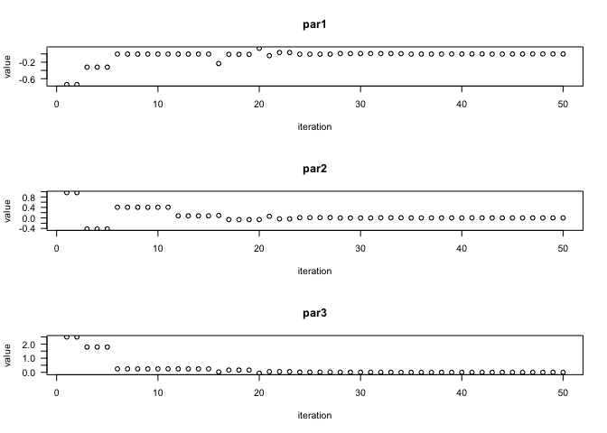<!-- -->

-   **Sphere Function**

``` r
#sphere
set.seed(1232)
DEoptim_2 <- DEoptim(sphere, lower=c(-10,-10,-10), upper=c(10,10, 10), DEoptim.control(NP=40, itermax=50))
```

    ## Iteration: 1 bestvalit: 7.719924 bestmemit:   -0.742832    0.962688    2.498271
    ## Iteration: 2 bestvalit: 3.474574 bestmemit:   -0.320580   -0.419554    1.787674
    ## Iteration: 3 bestvalit: 3.474574 bestmemit:   -0.320580   -0.419554    1.787674
    ## Iteration: 4 bestvalit: 3.474574 bestmemit:   -0.320580   -0.419554    1.787674
    ## Iteration: 5 bestvalit: 0.223649 bestmemit:   -0.002178    0.405836    0.242779
    ## Iteration: 6 bestvalit: 0.223649 bestmemit:   -0.002178    0.405836    0.242779
    ## Iteration: 7 bestvalit: 0.223649 bestmemit:   -0.002178    0.405836    0.242779
    ## Iteration: 8 bestvalit: 0.223649 bestmemit:   -0.002178    0.405836    0.242779
    ## Iteration: 9 bestvalit: 0.223649 bestmemit:   -0.002178    0.405836    0.242779
    ## Iteration: 10 bestvalit: 0.223649 bestmemit:   -0.002178    0.405836    0.242779
    ## Iteration: 11 bestvalit: 0.065091 bestmemit:   -0.002178    0.078387    0.242779
    ## Iteration: 12 bestvalit: 0.065091 bestmemit:   -0.002178    0.078387    0.242779
    ## Iteration: 13 bestvalit: 0.065091 bestmemit:   -0.002178    0.078387    0.242779
    ## Iteration: 14 bestvalit: 0.065091 bestmemit:   -0.002178    0.078387    0.242779
    ## Iteration: 15 bestvalit: 0.063107 bestmemit:   -0.232111    0.091889    0.028068
    ## Iteration: 16 bestvalit: 0.030034 bestmemit:   -0.010469   -0.065040    0.160293
    ## Iteration: 17 bestvalit: 0.030034 bestmemit:   -0.010469   -0.065040    0.160293
    ## Iteration: 18 bestvalit: 0.030034 bestmemit:   -0.010469   -0.065040    0.160293
    ## Iteration: 19 bestvalit: 0.026528 bestmemit:    0.136248   -0.061741   -0.064442
    ## Iteration: 20 bestvalit: 0.007729 bestmemit:   -0.041720    0.060595    0.048136
    ## Iteration: 21 bestvalit: 0.004731 bestmemit:    0.033929   -0.035539    0.048136
    ## Iteration: 22 bestvalit: 0.004731 bestmemit:    0.033929   -0.035539    0.048136
    ## Iteration: 23 bestvalit: 0.000432 bestmemit:   -0.006265    0.010752    0.016634
    ## Iteration: 24 bestvalit: 0.000432 bestmemit:   -0.006265    0.010752    0.016634
    ## Iteration: 25 bestvalit: 0.000432 bestmemit:   -0.006265    0.010752    0.016634
    ## Iteration: 26 bestvalit: 0.000432 bestmemit:   -0.006265    0.010752    0.016634
    ## Iteration: 27 bestvalit: 0.000147 bestmemit:    0.009929   -0.003788    0.005818
    ## Iteration: 28 bestvalit: 0.000147 bestmemit:    0.009929   -0.003788    0.005818
    ## Iteration: 29 bestvalit: 0.000147 bestmemit:    0.009929   -0.003788    0.005818
    ## Iteration: 30 bestvalit: 0.000147 bestmemit:    0.009929   -0.003788    0.005818
    ## Iteration: 31 bestvalit: 0.000120 bestmemit:    0.009382    0.004647    0.003158
    ## Iteration: 32 bestvalit: 0.000117 bestmemit:    0.009382    0.004647    0.002681
    ## Iteration: 33 bestvalit: 0.000079 bestmemit:    0.006361    0.005227   -0.003421
    ## Iteration: 34 bestvalit: 0.000022 bestmemit:   -0.003403   -0.001848   -0.002722
    ## Iteration: 35 bestvalit: 0.000012 bestmemit:   -0.001293   -0.001848   -0.002722
    ## Iteration: 36 bestvalit: 0.000012 bestmemit:   -0.001293   -0.001848   -0.002722
    ## Iteration: 37 bestvalit: 0.000012 bestmemit:   -0.001293   -0.001848   -0.002722
    ## Iteration: 38 bestvalit: 0.000011 bestmemit:   -0.000536   -0.001848   -0.002722
    ## Iteration: 39 bestvalit: 0.000011 bestmemit:   -0.000536   -0.001848   -0.002722
    ## Iteration: 40 bestvalit: 0.000009 bestmemit:    0.000085    0.003008    0.000408
    ## Iteration: 41 bestvalit: 0.000004 bestmemit:    0.001466    0.001375    0.000130
    ## Iteration: 42 bestvalit: 0.000004 bestmemit:   -0.001988   -0.000287    0.000085
    ## Iteration: 43 bestvalit: 0.000004 bestmemit:   -0.001988   -0.000287    0.000085
    ## Iteration: 44 bestvalit: 0.000000 bestmemit:   -0.000279   -0.000287    0.000085
    ## Iteration: 45 bestvalit: 0.000000 bestmemit:   -0.000279   -0.000287    0.000085
    ## Iteration: 46 bestvalit: 0.000000 bestmemit:    0.000189   -0.000000    0.000095
    ## Iteration: 47 bestvalit: 0.000000 bestmemit:    0.000189   -0.000000    0.000095
    ## Iteration: 48 bestvalit: 0.000000 bestmemit:    0.000189   -0.000000    0.000095
    ## Iteration: 49 bestvalit: 0.000000 bestmemit:    0.000189   -0.000000    0.000095
    ## Iteration: 50 bestvalit: 0.000000 bestmemit:    0.000189   -0.000000    0.000095

``` r
#plot of the optimization process for sphere function
plot(DEoptim_2)
```

<!-- -->

-   **Sum Square Function**

``` r
#sum square
set.seed(1233)
DEoptim_3 <- DEoptim(sum_sq, lower=c(-10,-10,-10), upper=c(10,10, 10), DEoptim.control(NP=40, itermax=50))
```

    ## Iteration: 1 bestvalit: 2.346816 bestmemit:    0.748773    0.661379    0.551153
    ## Iteration: 2 bestvalit: 2.346816 bestmemit:    0.748773    0.661379    0.551153
    ## Iteration: 3 bestvalit: 2.346816 bestmemit:    0.748773    0.661379    0.551153
    ## Iteration: 4 bestvalit: 1.385563 bestmemit:    0.409542   -0.755395    0.159788
    ## Iteration: 5 bestvalit: 1.385563 bestmemit:    0.409542   -0.755395    0.159788
    ## Iteration: 6 bestvalit: 1.385563 bestmemit:    0.409542   -0.755395    0.159788
    ## Iteration: 7 bestvalit: 0.586563 bestmemit:    0.409542    0.413668    0.159788
    ## Iteration: 8 bestvalit: 0.194618 bestmemit:    0.410530    0.091784    0.055482
    ## Iteration: 9 bestvalit: 0.194618 bestmemit:    0.410530    0.091784    0.055482
    ## Iteration: 10 bestvalit: 0.041501 bestmemit:    0.078908   -0.075156   -0.089401
    ## Iteration: 11 bestvalit: 0.041501 bestmemit:    0.078908   -0.075156   -0.089401
    ## Iteration: 12 bestvalit: 0.041501 bestmemit:    0.078908   -0.075156   -0.089401
    ## Iteration: 13 bestvalit: 0.041501 bestmemit:    0.078908   -0.075156   -0.089401
    ## Iteration: 14 bestvalit: 0.041501 bestmemit:    0.078908   -0.075156   -0.089401
    ## Iteration: 15 bestvalit: 0.041501 bestmemit:    0.078908   -0.075156   -0.089401
    ## Iteration: 16 bestvalit: 0.041501 bestmemit:    0.078908   -0.075156   -0.089401
    ## Iteration: 17 bestvalit: 0.041501 bestmemit:    0.078908   -0.075156   -0.089401
    ## Iteration: 18 bestvalit: 0.028041 bestmemit:   -0.121174   -0.014476   -0.065672
    ## Iteration: 19 bestvalit: 0.028041 bestmemit:   -0.121174   -0.014476   -0.065672
    ## Iteration: 20 bestvalit: 0.015939 bestmemit:    0.075784    0.021917    0.055482
    ## Iteration: 21 bestvalit: 0.015939 bestmemit:    0.075784    0.021917    0.055482
    ## Iteration: 22 bestvalit: 0.009471 bestmemit:    0.038261   -0.014476    0.050294
    ## Iteration: 23 bestvalit: 0.001058 bestmemit:    0.013751    0.011574    0.014159
    ## Iteration: 24 bestvalit: 0.001058 bestmemit:    0.013751    0.011574    0.014159
    ## Iteration: 25 bestvalit: 0.001058 bestmemit:    0.013751    0.011574    0.014159
    ## Iteration: 26 bestvalit: 0.001058 bestmemit:    0.013751    0.011574    0.014159
    ## Iteration: 27 bestvalit: 0.001058 bestmemit:    0.013751    0.011574    0.014159
    ## Iteration: 28 bestvalit: 0.001058 bestmemit:    0.013751    0.011574    0.014159
    ## Iteration: 29 bestvalit: 0.001058 bestmemit:    0.013751    0.011574    0.014159
    ## Iteration: 30 bestvalit: 0.001058 bestmemit:    0.013751    0.011574    0.014159
    ## Iteration: 31 bestvalit: 0.001058 bestmemit:    0.013751    0.011574    0.014159
    ## Iteration: 32 bestvalit: 0.000910 bestmemit:    0.029140   -0.003770    0.003303
    ## Iteration: 33 bestvalit: 0.000910 bestmemit:    0.029140   -0.003770    0.003303
    ## Iteration: 34 bestvalit: 0.000892 bestmemit:   -0.011157   -0.007014   -0.014939
    ## Iteration: 35 bestvalit: 0.000246 bestmemit:    0.013591   -0.003770    0.003303
    ## Iteration: 36 bestvalit: 0.000127 bestmemit:   -0.010481    0.000318    0.002394
    ## Iteration: 37 bestvalit: 0.000018 bestmemit:   -0.004070   -0.000390   -0.000720
    ## Iteration: 38 bestvalit: 0.000018 bestmemit:   -0.004070   -0.000390   -0.000720
    ## Iteration: 39 bestvalit: 0.000018 bestmemit:   -0.004070   -0.000390   -0.000720
    ## Iteration: 40 bestvalit: 0.000018 bestmemit:   -0.004070   -0.000390   -0.000720
    ## Iteration: 41 bestvalit: 0.000018 bestmemit:   -0.004070   -0.000390   -0.000720
    ## Iteration: 42 bestvalit: 0.000018 bestmemit:   -0.004070   -0.000390   -0.000720
    ## Iteration: 43 bestvalit: 0.000018 bestmemit:   -0.004070   -0.000390   -0.000720
    ## Iteration: 44 bestvalit: 0.000013 bestmemit:    0.001629   -0.002174    0.000450
    ## Iteration: 45 bestvalit: 0.000013 bestmemit:    0.001629   -0.002174    0.000450
    ## Iteration: 46 bestvalit: 0.000013 bestmemit:    0.001629   -0.002174    0.000450
    ## Iteration: 47 bestvalit: 0.000007 bestmemit:   -0.001523    0.000751   -0.001070
    ## Iteration: 48 bestvalit: 0.000004 bestmemit:   -0.001841   -0.000183   -0.000201
    ## Iteration: 49 bestvalit: 0.000004 bestmemit:   -0.001841   -0.000183   -0.000201
    ## Iteration: 50 bestvalit: 0.000004 bestmemit:   -0.001841   -0.000183   -0.000201

``` r
#plot of the optimization process for sum_square function
plot(DEoptim_3)
```

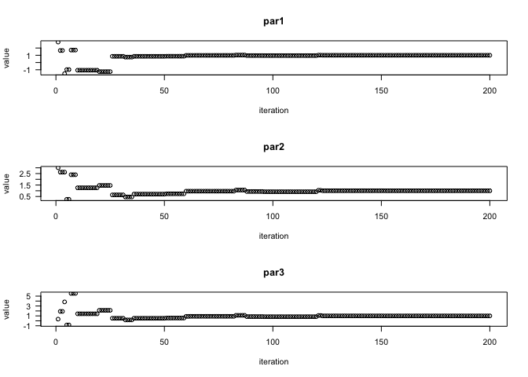<!-- -->

-   **Dixon&Price Function**

``` r
#dixon&price
set.seed(1234)
DEoptim_4 <- DEoptim(d_and_p, lower=c(-10,-10,-10), upper=c(10,10, 10), DEoptim.control(NP=40, itermax=50))
```

    ## Iteration: 1 bestvalit: 63.519670 bestmemit:    6.626901    1.319336   -1.289379
    ## Iteration: 2 bestvalit: 63.519670 bestmemit:    6.626901    1.319336   -1.289379
    ## Iteration: 3 bestvalit: 63.519670 bestmemit:    6.626901    1.319336   -1.289379
    ## Iteration: 4 bestvalit: 8.546650 bestmemit:   -0.770965    0.013502   -0.774465
    ## Iteration: 5 bestvalit: 8.546650 bestmemit:   -0.770965    0.013502   -0.774465
    ## Iteration: 6 bestvalit: 8.546650 bestmemit:   -0.770965    0.013502   -0.774465
    ## Iteration: 7 bestvalit: 8.546650 bestmemit:   -0.770965    0.013502   -0.774465
    ## Iteration: 8 bestvalit: 1.532689 bestmemit:    1.314040    0.758864   -0.200361
    ## Iteration: 9 bestvalit: 0.190456 bestmemit:    1.314040    0.758864    0.567721
    ## Iteration: 10 bestvalit: 0.190456 bestmemit:    1.314040    0.758864    0.567721
    ## Iteration: 11 bestvalit: 0.190456 bestmemit:    1.314040    0.758864    0.567721
    ## Iteration: 12 bestvalit: 0.190456 bestmemit:    1.314040    0.758864    0.567721
    ## Iteration: 13 bestvalit: 0.190456 bestmemit:    1.314040    0.758864    0.567721
    ## Iteration: 14 bestvalit: 0.190456 bestmemit:    1.314040    0.758864    0.567721
    ## Iteration: 15 bestvalit: 0.190456 bestmemit:    1.314040    0.758864    0.567721
    ## Iteration: 16 bestvalit: 0.190456 bestmemit:    1.314040    0.758864    0.567721
    ## Iteration: 17 bestvalit: 0.092510 bestmemit:    0.696443    0.585244    0.538243
    ## Iteration: 18 bestvalit: 0.040941 bestmemit:    0.951791    0.737264   -0.596446
    ## Iteration: 19 bestvalit: 0.040941 bestmemit:    0.951791    0.737264   -0.596446
    ## Iteration: 20 bestvalit: 0.040941 bestmemit:    0.951791    0.737264   -0.596446
    ## Iteration: 21 bestvalit: 0.040941 bestmemit:    0.951791    0.737264   -0.596446
    ## Iteration: 22 bestvalit: 0.040941 bestmemit:    0.951791    0.737264   -0.596446
    ## Iteration: 23 bestvalit: 0.040941 bestmemit:    0.951791    0.737264   -0.596446
    ## Iteration: 24 bestvalit: 0.040941 bestmemit:    0.951791    0.737264   -0.596446
    ## Iteration: 25 bestvalit: 0.040941 bestmemit:    0.951791    0.737264   -0.596446
    ## Iteration: 26 bestvalit: 0.040941 bestmemit:    0.951791    0.737264   -0.596446
    ## Iteration: 27 bestvalit: 0.040941 bestmemit:    0.951791    0.737264   -0.596446
    ## Iteration: 28 bestvalit: 0.040941 bestmemit:    0.951791    0.737264   -0.596446
    ## Iteration: 29 bestvalit: 0.040941 bestmemit:    0.951791    0.737264   -0.596446
    ## Iteration: 30 bestvalit: 0.040941 bestmemit:    0.951791    0.737264   -0.596446
    ## Iteration: 31 bestvalit: 0.040941 bestmemit:    0.951791    0.737264   -0.596446
    ## Iteration: 32 bestvalit: 0.040941 bestmemit:    0.951791    0.737264   -0.596446
    ## Iteration: 33 bestvalit: 0.040941 bestmemit:    0.951791    0.737264   -0.596446
    ## Iteration: 34 bestvalit: 0.040941 bestmemit:    0.951791    0.737264   -0.596446
    ## Iteration: 35 bestvalit: 0.040941 bestmemit:    0.951791    0.737264   -0.596446
    ## Iteration: 36 bestvalit: 0.037140 bestmemit:    0.997439    0.751015   -0.599708
    ## Iteration: 37 bestvalit: 0.018295 bestmemit:    0.986512    0.704419   -0.559851
    ## Iteration: 38 bestvalit: 0.016022 bestmemit:    1.059073    0.751015   -0.599708
    ## Iteration: 39 bestvalit: 0.016022 bestmemit:    1.059073    0.751015   -0.599708
    ## Iteration: 40 bestvalit: 0.008449 bestmemit:    0.917018    0.667357   -0.580995
    ## Iteration: 41 bestvalit: 0.001647 bestmemit:    0.986512    0.704419   -0.584316
    ## Iteration: 42 bestvalit: 0.001410 bestmemit:    1.007968    0.704419   -0.586285
    ## Iteration: 43 bestvalit: 0.001158 bestmemit:    1.004185    0.704419   -0.586285
    ## Iteration: 44 bestvalit: 0.001158 bestmemit:    1.004185    0.704419   -0.586285
    ## Iteration: 45 bestvalit: 0.000597 bestmemit:    1.018041    0.717523   -0.599153
    ## Iteration: 46 bestvalit: 0.000597 bestmemit:    1.018041    0.717523   -0.599153
    ## Iteration: 47 bestvalit: 0.000597 bestmemit:    1.018041    0.717523   -0.599153
    ## Iteration: 48 bestvalit: 0.000597 bestmemit:    1.018041    0.717523   -0.599153
    ## Iteration: 49 bestvalit: 0.000597 bestmemit:    1.018041    0.717523   -0.599153
    ## Iteration: 50 bestvalit: 0.000397 bestmemit:    0.989883    0.707446   -0.596446

``` r
#plot of the optimization process for dixon&price function
plot(DEoptim_4)
```

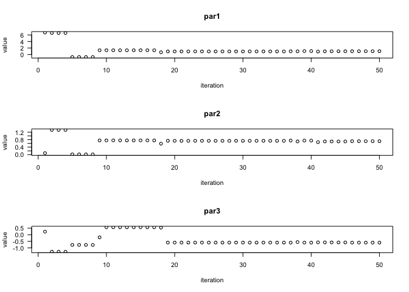<!-- -->

#### Why DEoptim ?

-   **DEoptim** performs function evaluations repeatedly to reach at
    better function/parameter values with each iteration.

-   The evalations can be performed at faster rate by running the
    package in parallel mode.

-   Output can be visualised easily using the plot method which makes it
    easy to read and understand. Also the maximum number of iterations
    to be performed can be changed according to the problem.

-   If the function evaluates to **NA** or **NaN** value for any set of
    parameter then DEoptim stops iterating further. Although the issue
    can be resolved by defining our function in such a way that it
    returns Inf in place of NA.

------------------------------------------------------------------------

### 2. ABCoptim

``` r
require(ABCoptim)
```

    ## Loading required package: ABCoptim

####Optimising above function using ABCoptim package. \* **Rosenbrock
Function**

``` r
#Rosenbrock
ABCoptim_1 <- abc_optim(c(1,2,3), Rosenbrock, lb=-10, ub=10, criter=50, maxCycle=200)
print(ABCoptim_1)
```

    ## 
    ##  An object of class -abc_answer- (Artificial Bee Colony Optim.):
    ##  par:
    ##     x[1]:  1.017795
    ##     x[2]:  1.032270
    ##     x[3]:  1.073939
    ## 
    ##  value:
    ##            0.009666
    ## 
    ##  counts:
    ##            119

``` r
plot(ABCoptim_1, main="Rosenbrock")
```

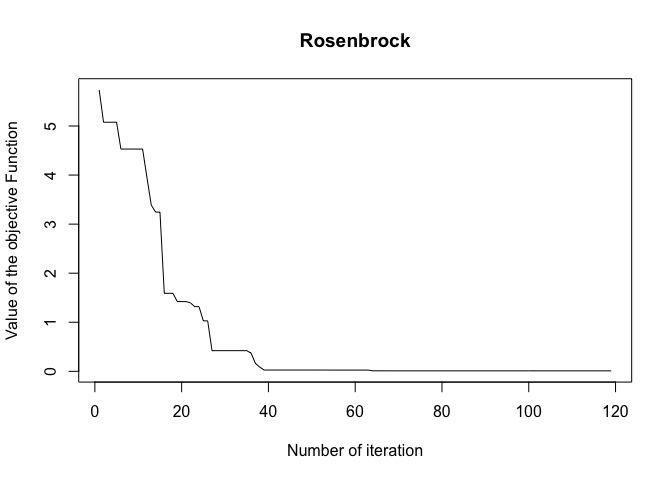<!-- -->

-   **Sphere Function**

``` r
#sphere
ABCoptim_2 <- abc_optim(c(1,2,3), sphere, lb=-10, ub=10, criter=50)
plot(ABCoptim_2, main="Sphere")
```

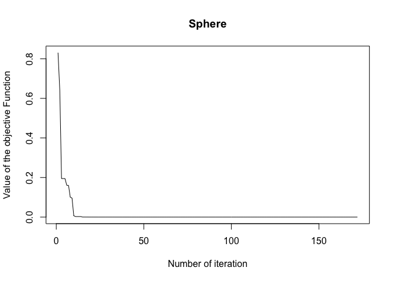<!-- -->

-   **Sum Square Function**

``` r
#sum_square
ABCoptim_3 <- abc_optim(c(1,2,3), sum_sq, lb=-10, ub=10, criter=50)
plot(ABCoptim_3, main="Sum Sqaure")
```

<!-- -->

-   **Dixon&price Function**

``` r
#dixon&price
ABCoptim_4 <- abc_optim(c(1,2,3), d_and_p, FoodNumber = 50, lb=-10, ub=10, criter=50)
plot(ABCoptim_4, main="Dixon&Price")
```

<!-- -->

#### Why ABCoptim ?

-   **abc_optim** is an implementation of **ABC optimization
    algorithm**. The optimization can be done within less number of
    iteration if we increase the FoodNumber( i.e. number of food sources
    ).

-   The package also provides **abc_cpp** method which is a C++
    implementation of the algorithm and is much more faster then
    apc_optim.

-   Like DEoptim, ABCoptim also provides plot method which makes it easy
    to visualize the optimization process.

------------------------------------------------------------------------

### 3. Rgenoud

``` r
require(rgenoud)
```

    ## Loading required package: rgenoud

    ## ##  rgenoud (Version 5.8-3.0, Build Date: 2019-01-22)
    ## ##  See http://sekhon.berkeley.edu/rgenoud for additional documentation.
    ## ##  Please cite software as:
    ## ##   Walter Mebane, Jr. and Jasjeet S. Sekhon. 2011.
    ## ##   ``Genetic Optimization Using Derivatives: The rgenoud package for R.''
    ## ##   Journal of Statistical Software, 42(11): 1-26. 
    ## ##

#### Optimising above function using rgenoud package.

-   **Rosenbrock Function**

``` r
#Rosenbrock
genoud_1 <- genoud(fn=Rosenbrock, pop.size=2000, nvars=4, starting.values=matrix(1:4, ncol=4), wait.generation=20, print.level=0 )
genoud_1
```

    ## $value
    ## [1] 9.338559e-08
    ## 
    ## $par
    ## [1] 0.9999329 0.9998665 0.9997336 0.9994673
    ## 
    ## $gradients
    ## [1] -4.001018e-04 -3.997974e-04 -3.997097e-04 -1.029086e-07
    ## 
    ## $generations
    ## [1] 22
    ## 
    ## $peakgeneration
    ## [1] 1
    ## 
    ## $popsize
    ## [1] 2000
    ## 
    ## $operators
    ## [1] 249 250 250 250 250 250 250 250   0

-   **Sphere Function**

``` r
#sphere
genoud_2 <- genoud(fn=sphere, pop.size=2000, nvars=4, starting.values=matrix(1:4, ncol=4), wait.generation=20, print.level=0)
genoud_2
```

    ## $value
    ## [1] 3.822482e-31
    ## 
    ## $par
    ## [1] -4.063599e-16 -3.493849e-16  1.554155e-16 -2.662632e-16
    ## 
    ## $gradients
    ## [1] -8.127210e-16 -6.987683e-16  3.108307e-16 -5.325268e-16
    ## 
    ## $generations
    ## [1] 22
    ## 
    ## $peakgeneration
    ## [1] 1
    ## 
    ## $popsize
    ## [1] 2000
    ## 
    ## $operators
    ## [1] 249 250 250 250 250 250 250 250   0

-   **Sum Square Function**

``` r
#sum_square
genoud_3 <- genoud(fn=sum_sq, pop.size=2000, nvars=4, starting.values=matrix(1:4, ncol=4), wait.generation=20, print.level=0)
genoud_3
```

    ## $value
    ## [1] 4.056231e-32
    ## 
    ## $par
    ## [1] -1.953432e-16 -9.352409e-20  9.625583e-19  2.449771e-17
    ## 
    ## $gradients
    ## [1] -3.906858e-16 -3.722313e-19  5.774522e-18  1.959856e-16
    ## 
    ## $generations
    ## [1] 22
    ## 
    ## $peakgeneration
    ## [1] 1
    ## 
    ## $popsize
    ## [1] 2000
    ## 
    ## $operators
    ## [1] 249 250 250 250 250 250 250 250   0

-   **Dixon&price Function**

``` r
#dixon&price
genoud_4 <- genoud(fn=d_and_p, pop.size=2000, nvars=4,starting.values=matrix(1:4, ncol=4), wait.generation=20, print.level=0 )
genoud_4
```

    ## $value
    ## [1] 7.926027e-11
    ## 
    ## $par
    ## [1] 0.9999945 0.7071042 0.5946011 0.5452521
    ## 
    ## $gradients
    ## [1] -3.285809e-06 -1.818542e-06 -3.596430e-05 -2.520846e-05
    ## 
    ## $generations
    ## [1] 22
    ## 
    ## $peakgeneration
    ## [1] 1
    ## 
    ## $popsize
    ## [1] 2000
    ## 
    ## $operators
    ## [1] 249 250 250 250 250 250 250 250   0

#### Why rgenoud?

-   **rgenoud** provides **genoud** function that works on evolutionary
    algorithm. The function provides a wide range of arguments to
    monitor the optimization process. And compared to derivative based
    optimization methods, **genoud** is much more effective.

-   **genoud** function even works for problems for which the derivative
    information does not exist.

-   The function allows users to set arguments such as **pop.size**(i.e
    initial population size that the function will use for implementing
    evolutionary algorithm), **max.generation** and
    **wait.generation**(i.e limit on the number of generation that would
    take place while execution of evolutionary algorithm) so that
    optimization results in more accurate solution.

------------------------------------------------------------------------

### 4. Genalg

``` r
#loading package genalg
require(genalg)
```

    ## Loading required package: genalg

#### Optimising Rosenbrock function using genalg package.

``` r
#function to display the progress of the optimisation process.
monitor <- function(obj) {
     # plot the population
     xlim = c(obj$stringMin[1], obj$stringMax[1]);
     ylim = c(obj$stringMin[2], obj$stringMax[2]);
     iteration_num = obj$iter
     lbl = paste("Iteration Number: ", obj$iter);
     if(((iteration_num)%%10)==1 || iteration_num==100){
       plot(obj$population, xlim=xlim, ylim=ylim,
          xlab="x", ylab="y", main=lbl);
     }
}

#Optimising Rosenbrock Function 
rbga.results1 = rbga(c(-10, -10), c(10, 10), monitorFunc=monitor, evalFunc=Rosenbrock, mutationChance=0.001)
```

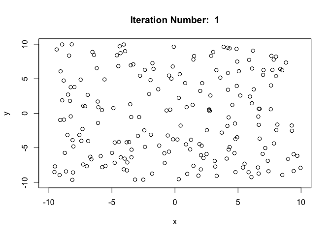<!-- -->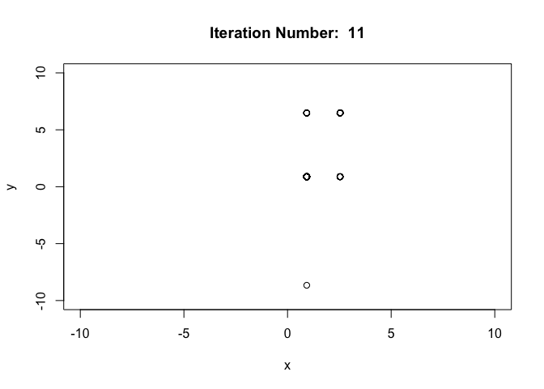<!-- --><!-- -->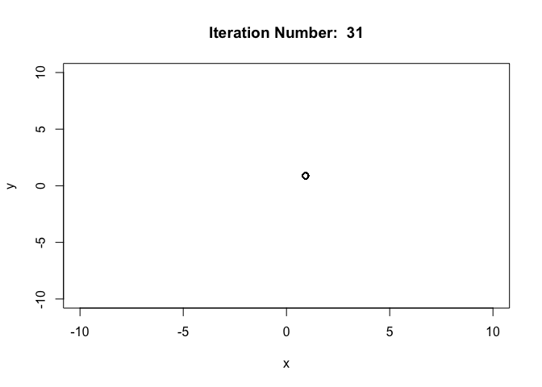<!-- --><!-- --><!-- -->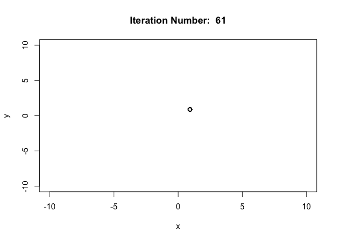<!-- -->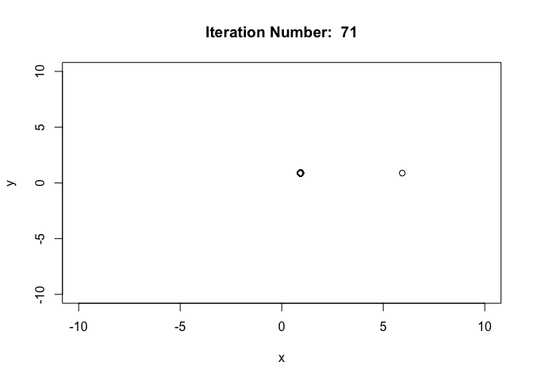<!-- --><!-- --><!-- -->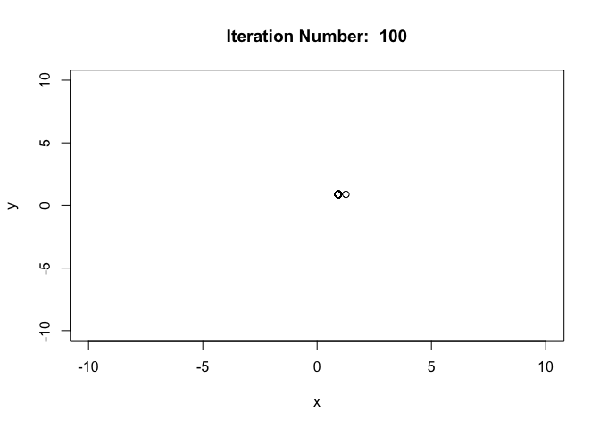<!-- -->

#### Why genalg?

-   **genalg** is an optimization package which is based on genetic
    algorithm. It provides **rbga** function for the optimization
    purpose. We can set different parameters such as **mutationChance**,
    **popSize**, **suggestions** and **iters** according to the need of
    the problem to be optimised.

-   **genalg** package has a **plot** function also which can be used to
    visualize the optimization process.

-   In addition to the above specified parameters, **rbga** also allows
    users to monitor the optimization process as it progresses by
    providing a monitor function to the parameter **monitorFunc**. As in
    the above R code I have provided a monitor function which plots the
    population after every (10\*x + 1)th iteration of the optimization.

-   Also it can be seen from above plots that optimization using rbga
    function is quite effective. That is the optimized populations were
    obtained within less number of iterations and are accurate also.
    This is because the parameter **mutationChance** is very low which
    implies that convergence would be achieved faster.

------------------------------------------------------------------------

## Task5

Prepare R code for the volcano function of two parameters b=c(x,y) that
is defined as f(d) = (10 - 0.5(d)) + sin(2\*d) where d is the square
norm distance from x=1, y=5. What are the likely issues in minimizing
this function over the two dimensions? A \[3D\] perspective plot may
help you. Do solvers have trouble getting sensible results for this
function?

``` r
volcano<-function(x){
  x <- matrix(x, ncol=2)
  d<-apply(x,1,function(y){ (y[1]-1)^2 + (y[2]-5)^2 })
  ans<-((10 - 0.5*d) + sin(2*d))
  ans
}

x <- seq(-50, 50, length = 101)
y <- seq(-50, 50, length = 101)
X <- as.matrix(expand.grid(x,y))
colnames(X) <- c("x", "y")
# evaluate function
z <- volcano(X)

df <- data.frame(X, z)
# plot the function
library(lattice)
wireframe(z ~ x * y , data=df, main = "Plot of volcano function", shade = TRUE, scales = list(arrows = FALSE), screen = list(z = -50, x = -70))
```

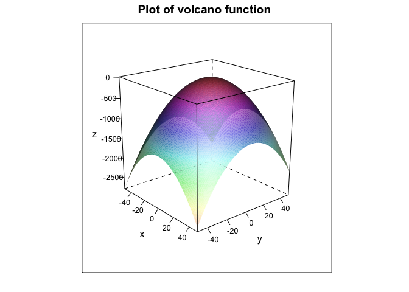<!-- -->

``` r
#using opm solvers for volcano function
result1<-opm(c(0,0), volcano, method=c("L-BFGS-B", "Nelder-Mead", "CG", "Rcgmin", "Rvmmin","BFGS"), control=list(kkt=FALSE, trace=0))
result1
```

    ##                        p1            p2         value fevals gevals convergence
    ## L-BFGS-B    -1.935518e-01 -9.678714e-01 -9.488273e+00     13     13           0
    ## Nelder-Mead -6.297067e-02  1.684581e-01 -3.205087e+00     45     NA           0
    ## CG           3.851191e+13 -1.094680e+14 -6.733210e+27     67     31           0
    ## Rcgmin       0.000000e+00  0.000000e+00 -2.013372e+00      1      1           0
    ## Rvmmin       0.000000e+00  0.000000e+00 -2.013372e+00      1      1           2
    ## BFGS        -1.639873e+00 -8.213043e+00 -8.174490e+01     15      6           0
    ##             kkt1 kkt2 xtime
    ## L-BFGS-B      NA   NA 0.008
    ## Nelder-Mead   NA   NA 0.001
    ## CG            NA   NA 0.004
    ## Rcgmin        NA   NA 0.001
    ## Rvmmin        NA   NA 0.001
    ## BFGS          NA   NA 0.001

#### Issues while optimizing Volcano function.

-   The plot indicates that the function acquires its minimum value at
    infinite. Optimization of such functions might give wrong solutions
    as it is giving with different **opm** solvers( although the
    convergence code is 0 ). Also most of the optimization solvers in R
    requires boundaries to be defined for the parameters, and for the
    volcano function choosing a boundary is not much convenient.

-   Some of the solvers(**ABCoptim**) tend to assign **NA/NaN** value to
    the parameter “x”(passed to volcano function) during the
    optimization process which results in **Warning: NA/NaN function
    evaluation** and they keep on producing the same warning until the
    iteration limit is reached and in the end they provide a wrong
    solution.
