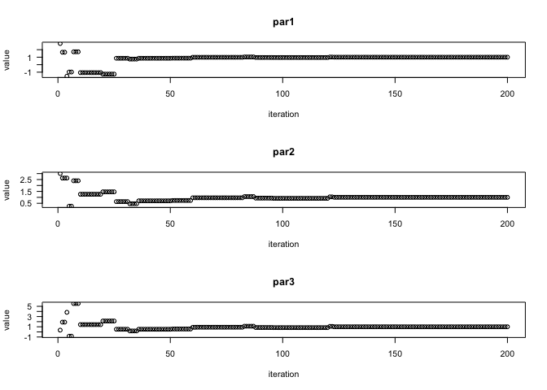
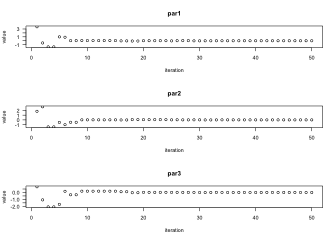

Tests
================

## Test 1

Prepare R code for three of the unconstrained test functions in [GO Test
Problems](http://www-optima.amp.i.kyoto-u.ac.jp/member/student/hedar/Hedar_files/TestGO.htm)
that allow dimension greater than 4

-   **Rosenbrock**

``` r
Rosenbrock<-function(x){
    len<-length(x)
    sum((100*(x[-len]^2-x[-1])^2) + (x[-len]-rep(1, len-1))^2)
}

#gradient function
Rosenbrock.g<-function(x){
  len<-length(x)
  g<-rep(NA, len)
  g[1]<- 2*(x[1]-1) + 400*x[1]*(x[1]^2-x[2])
  g[2:(len-1)] <- 2*(x[2:(len-1)]-1) + 400*x[2:(len-1)]*(x[2:(len-1)]^2-x[2:(len-1) + 1]) + 200*(x[2:(len-1)]-x[2:(len-1) - 1]^2)
  g[len] <- 200 * (x[len] - x[len - 1]^2)
  g
}
Rosenbrock(c(1,2,3,4))
```

    ## [1] 2705

-   **Sphere Func.**

``` r
sphere<-function(x){
    sum(x^2)
}

#gradient function
sphere.g<-function(x){
  len<-length(x)
  g<-rep(NA, len)
  g[1:len]<-2*x
  g
}

sphere(c(1,2,3,4))
```

    ## [1] 30

-   **Sum square**

``` r
sum_sq<-function(x){
  len<-length(x)
    sum(seq(1, len, length=len)*(x^2))
}

#gradient function
sum_sq.g<-function(x){
  len<-length(x)
  g<-rep(NA, len)
  g[1:len]<-seq(1, len, length=len)*2*x
  g
}

sum_sq(c(1,2,3,4))
```

    ## [1] 100

-   **Dixon&Price**

``` r
d_and_p<-function(x){
    len<-length(x)
    t1<-(x[1]-1)^2
    t2<-sum(seq(2,len, length=len-1)*(2*x[-1]^2-x[-len])^2)
    t1+t2
}

#gradient function
d_and_p.g<-function(x){
  len<-length(x)
  g<-rep(NA, len)
  g[1]<-2*(x[1]-1) - 4*(2*x[2]^2-x[1])
  g[2:(len-1)]<- 8*seq(2,len-1, length=len-2)*x[2:(len-1)]*(2*x[2:(len-1)]^2-x[1:(len-2)]) - 2*seq(3,len, length=len-2)*(2*x[3:len]^2-x[2:(len-1)])
  g[len]<-8*len*x[len]*(2*x[len]^2-x[len-1])
  g
}
d_and_p(c(1,2,3,4))
```

    ## [1] 4230

## Test 2

Try to minimize these with the base R **optim()** function. Be sure to
document what you do.

``` r
#Rosenbrock
optm_1<-optim(c(1,2,3,4), Rosenbrock, Rosenbrock.g, method="BFGS")
optm_1
```

    ## $par
    ## [1] 1 1 1 1
    ## 
    ## $value
    ## [1] 5.676878e-17
    ## 
    ## $counts
    ## function gradient 
    ##       99       37 
    ## 
    ## $convergence
    ## [1] 0
    ## 
    ## $message
    ## NULL

``` r
#sphere
optm_2<-optim(c(1,2,3,4), sphere, sphere.g, method="CG")
optm_2
```

    ## $par
    ## [1] 2.204415e-07 4.408831e-07 6.613246e-07 8.817661e-07
    ## 
    ## $value
    ## [1] 1.457834e-12
    ## 
    ## $counts
    ## function gradient 
    ##       15        8 
    ## 
    ## $convergence
    ## [1] 0
    ## 
    ## $message
    ## NULL

``` r
#Sum square
optm_3<-optim(c(1,2,3,4), sum_sq, method="SANN")
optm_3
```

    ## $par
    ## [1]  0.02531189  0.04513995  0.04762775 -0.02330931
    ## 
    ## $value
    ## [1] 0.01369442
    ## 
    ## $counts
    ## function gradient 
    ##    10000       NA 
    ## 
    ## $convergence
    ## [1] 0
    ## 
    ## $message
    ## NULL

``` r
#dixon&price
optm_4<-optim(c(1,2,3,4), d_and_p, method="Nelder-Mead")
optm_4
```

    ## $par
    ## [1]  0.9999534  0.7081443  0.5953718 -0.5449882
    ## 
    ## $value
    ## [1] 2.694426e-05
    ## 
    ## $counts
    ## function gradient 
    ##      295       NA 
    ## 
    ## $convergence
    ## [1] 0
    ## 
    ## $message
    ## NULL

## Test 3

Run several (at least 4) solvers at once with the **opm()** function

``` r
require(optimr)
```

    ## Loading required package: optimr

``` r
#Rosenbrock
result1<-opm(c(1,2,3,4), Rosenbrock, Rosenbrock.g, method="ALL", control=list(kkt=FALSE, trace=0))
result1
```

    ##                    p1        p2        p3        p4        value fevals gevals
    ## BFGS        1.0000000 1.0000000 1.0000000 1.0000000 5.676878e-17     99     37
    ## CG          1.1117180 1.2374887 1.5330875 2.3535077 3.534559e-01   3298   1001
    ## Nelder-Mead 0.9999500 0.9995963 0.9987679 0.9973660 3.189882e-05    513     NA
    ## L-BFGS-B    0.9999997 0.9999995 0.9999990 0.9999984 1.207693e-11     43     43
    ## nlm         1.0000000 1.0000000 0.9999999 0.9999999 7.364247e-14     NA     79
    ## nlminb      1.0000000 1.0000000 1.0000000 1.0000000 1.887858e-16     54     40
    ## Rcgmin      1.0000001 1.0000002 1.0000003 1.0000006 1.316622e-13    137     63
    ## Rvmmin      1.0000000 1.0000000 1.0000000 1.0000000 3.722437e-30     65     44
    ## hjn         1.0000006 1.0000012 1.0000024 1.0000047 8.483011e-12   3500     NA
    ##             convergence kkt1 kkt2 xtime
    ## BFGS                  0   NA   NA 0.001
    ## CG                    1   NA   NA 0.015
    ## Nelder-Mead           0   NA   NA 0.002
    ## L-BFGS-B              0   NA   NA 0.001
    ## nlm                   0   NA   NA 0.001
    ## nlminb                0   NA   NA 0.002
    ## Rcgmin                0   NA   NA 0.002
    ## Rvmmin                0   NA   NA 0.004
    ## hjn                   0   NA   NA 0.019

``` r
#sphere
result2<-opm(c(1,2,3,4), sphere, sphere.g, method="ALL", control=list(kkt=FALSE, trace=0))
```

    ## Warning in nlminb(start = spar, objective = efn, gradient = egr, lower =
    ## slower, : NA/NaN function evaluation

``` r
result2
```

    ##                         p1             p2             p3             p4
    ## BFGS         -2.183439e-16  -4.366877e-16   1.221245e-16   3.700743e-16
    ## CG            2.204415e-07   4.408831e-07   6.613246e-07   8.817661e-07
    ## Nelder-Mead  -1.261488e-04   4.478612e-04   9.807649e-05   1.402697e-04
    ## L-BFGS-B     -9.860761e-32  -1.972152e-31  -3.944305e-31  -3.944305e-31
    ## nlm           0.000000e+00   0.000000e+00   0.000000e+00   0.000000e+00
    ## nlminb       3.133255e-167 -1.348723e-167 -1.184606e-167  2.739049e-167
    ## Rcgmin       -6.661338e-16  -1.332268e-15  -1.776357e-15  -2.664535e-15
    ## Rvmmin        1.110223e-16   2.220446e-16  -2.220446e-16  -4.440892e-16
    ## hjn           0.000000e+00   0.000000e+00   0.000000e+00   0.000000e+00
    ##                    value fevals gevals convergence kkt1 kkt2 xtime
    ## BFGS        2.179639e-30      5      3           0   NA   NA 0.000
    ## CG          1.457834e-12     15      8           0   NA   NA 0.000
    ## Nelder-Mead 2.457878e-07    207     NA           0   NA   NA 0.000
    ## L-BFGS-B    3.597681e-61      4      4           0   NA   NA 0.000
    ## nlm         0.000000e+00     NA      1           0   NA   NA 0.000
    ## nlminb      0.000000e+00     30     27           0   NA   NA 0.000
    ## Rcgmin      1.247386e-29      4      2           0   NA   NA 0.000
    ## Rvmmin      3.081488e-31      4      3           2   NA   NA 0.001
    ## hjn         0.000000e+00    128     NA           0   NA   NA 0.001

``` r
#sum_square
result3<-opm(c(1,2,3,4), sum_sq, sum_sq.g, method="ALL", control=list(kkt=FALSE, trace=0))
```

    ## Warning in nlminb(start = spar, objective = efn, gradient = egr, lower =
    ## slower, : NA/NaN function evaluation

``` r
result3
```

    ##                         p1             p2             p3             p4
    ## BFGS         -1.941783e-14  -3.049467e-13  -1.766722e-12   7.956968e-13
    ## CG            5.703672e-07  -7.784541e-08   4.351182e-08   9.908794e-08
    ## Nelder-Mead  -5.818810e-04   3.955017e-05   3.673549e-05  -2.442033e-04
    ## L-BFGS-B      1.892986e-07   3.767959e-06   2.396254e-06   5.000826e-06
    ## nlm           1.623039e-07   4.749345e-08   1.428741e-08  -1.450018e-08
    ## nlminb       3.201704e-168 -5.247493e-169  2.560660e-168 -1.200510e-168
    ## Rcgmin       -2.775558e-17  -1.387779e-17  -1.734723e-17   1.218643e-16
    ## Rvmmin       -6.706204e-16  -6.761823e-16  -2.509268e-16  -2.508378e-15
    ## hjn           0.000000e+00   0.000000e+00   0.000000e+00   0.000000e+00
    ##                    value fevals gevals convergence kkt1 kkt2 xtime
    ## BFGS        1.208497e-23     37     17           0   NA   NA 0.004
    ## CG          3.823921e-13     51     21           0   NA   NA 0.001
    ## Nelder-Mead 5.843035e-07    165     NA           0   NA   NA 0.002
    ## L-BFGS-B    1.456900e-10     10     10           0   NA   NA 0.000
    ## nlm         3.230721e-14     NA     11           0   NA   NA 0.002
    ## nlminb      0.000000e+00     55     49           0   NA   NA 0.001
    ## Rcgmin      6.146199e-32     10      5           0   NA   NA 0.000
    ## Rvmmin      2.672091e-29     20     16           0   NA   NA 0.002
    ## hjn         0.000000e+00    128     NA           0   NA   NA 0.002

``` r
#dixon&price
result4<-opm(c(1,2,3,4), d_and_p, d_and_p.g, method="ALL", control=list(kkt=FALSE, trace=0))
result4
```

    ##                    p1        p2        p3         p4        value fevals gevals
    ## BFGS        1.0000000 0.7071068 0.5946036 -0.5452539 3.899315e-20     57     26
    ## CG          0.9999991 0.7071064 0.5946033 -0.5452537 9.031343e-13    150     55
    ## Nelder-Mead 0.9999534 0.7081443 0.5953718 -0.5449882 2.694426e-05    295     NA
    ## L-BFGS-B    0.9999982 0.7071062 0.5946031  0.5452535 4.912154e-12     23     23
    ## nlm         0.9999999 0.7071068 0.5946035 -0.5452538 9.342096e-14     NA     31
    ## nlminb      1.0000000 0.7071068 0.5946036  0.5452539 6.132918e-22     20     18
    ## Rcgmin      1.0000000 0.7071068 0.5946036  0.5452539 1.338168e-15     48     25
    ## Rvmmin      1.0000000 0.7071068 0.5946036 -0.5452539 3.821045e-29     37     27
    ## hjn         1.0000001 0.7071068 0.5946036  0.5452539 5.463278e-14    660     NA
    ##             convergence kkt1 kkt2 xtime
    ## BFGS                  0   NA   NA 0.018
    ## CG                    0   NA   NA 0.003
    ## Nelder-Mead           0   NA   NA 0.004
    ## L-BFGS-B              0   NA   NA 0.001
    ## nlm                   0   NA   NA 0.002
    ## nlminb                0   NA   NA 0.001
    ## Rcgmin                0   NA   NA 0.002
    ## Rvmmin                0   NA   NA 0.003
    ## hjn                   0   NA   NA 0.009

#### Observations from above Result

-   For problems which has quite significant scaling factor(Eg:
    Rosenbrock function), non gradient methods such as **Nelder-Mead**
    and **hjn** does large function evaluations to arrive at results.

-   For simpler problems such as Sphere function, **Nelder-Mead** and
    **hjn** requires relatively less number of evaluations as compared
    to Rosenbrock problem but still it is larger then as required by
    other gradient optimization methods for the same problem.

-   **CG** method reaches its iteration limit and does not able to find
    the minimum for the Rosenbrock function. Also it can be seen that
    this method takes relatively more function and gradient computations
    compared to other gradient methods.

-   **Rvmmin** method achieves better results compared to other methods
    and for the Rosenbrock problem **Rvmmin** comes up with the best
    accuracy.

-   **BFGS**, **L-BFGS-B** and **Rcgmin** are obtaining good results
    with less number of computaions envolved.

#### Conlusion

-   For purpose of achieving better results we can use **L-BFGS-B**,
    **Rvmmin**, **BFGS** and **Rcgmin** by providing analytic gradient
    to these functions. These methods performs good even for
    large/difficult problems.

##Test 4

``` r
require(DEoptim)
```

    ## Loading required package: DEoptim

    ## Loading required package: parallel

    ## 
    ## DEoptim package
    ## Differential Evolution algorithm in R
    ## Authors: D. Ardia, K. Mullen, B. Peterson and J. Ulrich

``` r
#Rosenbrock
DEoptim_1 <- DEoptim(Rosenbrock, lower=c(-10,-10,-10), upper=c(10,10, 10), DEoptim.control(NP=40 ))
```

    ## Iteration: 1 bestvalit: 361.181296 bestmemit:   -1.138922   -0.535090   -0.144277
    ## Iteration: 2 bestvalit: 361.181296 bestmemit:   -1.138922   -0.535090   -0.144277
    ## Iteration: 3 bestvalit: 57.627552 bestmemit:   -1.542247    2.844043    7.577766
    ## Iteration: 4 bestvalit: 23.075305 bestmemit:    0.998653    1.016505    1.513263
    ## Iteration: 5 bestvalit: 23.075305 bestmemit:    0.998653    1.016505    1.513263
    ## Iteration: 6 bestvalit: 23.075305 bestmemit:    0.998653    1.016505    1.513263
    ## Iteration: 7 bestvalit: 23.075305 bestmemit:    0.998653    1.016505    1.513263
    ## Iteration: 8 bestvalit: 23.075305 bestmemit:    0.998653    1.016505    1.513263
    ## Iteration: 9 bestvalit: 12.089045 bestmemit:   -0.218303   -0.225740    0.178543
    ## Iteration: 10 bestvalit: 12.089045 bestmemit:   -0.218303   -0.225740    0.178543
    ## Iteration: 11 bestvalit: 12.089045 bestmemit:   -0.218303   -0.225740    0.178543
    ## Iteration: 12 bestvalit: 12.089045 bestmemit:   -0.218303   -0.225740    0.178543
    ## Iteration: 13 bestvalit: 5.447195 bestmemit:    1.320807    1.569468    2.323400
    ## Iteration: 14 bestvalit: 5.447195 bestmemit:    1.320807    1.569468    2.323400
    ## Iteration: 15 bestvalit: 1.481513 bestmemit:    0.860592    0.800565    0.537805
    ## Iteration: 16 bestvalit: 1.481513 bestmemit:    0.860592    0.800565    0.537805
    ## Iteration: 17 bestvalit: 1.481513 bestmemit:    0.860592    0.800565    0.537805
    ## Iteration: 18 bestvalit: 1.481513 bestmemit:    0.860592    0.800565    0.537805
    ## Iteration: 19 bestvalit: 1.481513 bestmemit:    0.860592    0.800565    0.537805
    ## Iteration: 20 bestvalit: 1.481513 bestmemit:    0.860592    0.800565    0.537805
    ## Iteration: 21 bestvalit: 1.481513 bestmemit:    0.860592    0.800565    0.537805
    ## Iteration: 22 bestvalit: 1.481513 bestmemit:    0.860592    0.800565    0.537805
    ## Iteration: 23 bestvalit: 1.481513 bestmemit:    0.860592    0.800565    0.537805
    ## Iteration: 24 bestvalit: 1.481513 bestmemit:    0.860592    0.800565    0.537805
    ## Iteration: 25 bestvalit: 1.481513 bestmemit:    0.860592    0.800565    0.537805
    ## Iteration: 26 bestvalit: 1.481513 bestmemit:    0.860592    0.800565    0.537805
    ## Iteration: 27 bestvalit: 1.481513 bestmemit:    0.860592    0.800565    0.537805
    ## Iteration: 28 bestvalit: 1.161380 bestmemit:    1.264931    1.655428    2.800020
    ## Iteration: 29 bestvalit: 1.161380 bestmemit:    1.264931    1.655428    2.800020
    ## Iteration: 30 bestvalit: 1.161380 bestmemit:    1.264931    1.655428    2.800020
    ## Iteration: 31 bestvalit: 1.034578 bestmemit:    0.879121    0.840763    0.779920
    ## Iteration: 32 bestvalit: 1.034578 bestmemit:    0.879121    0.840763    0.779920
    ## Iteration: 33 bestvalit: 1.034578 bestmemit:    0.879121    0.840763    0.779920
    ## Iteration: 34 bestvalit: 0.903356 bestmemit:    0.974233    0.885046    0.852500
    ## Iteration: 35 bestvalit: 0.217393 bestmemit:    0.920714    0.892273    0.793066
    ## Iteration: 36 bestvalit: 0.217393 bestmemit:    0.920714    0.892273    0.793066
    ## Iteration: 37 bestvalit: 0.217393 bestmemit:    0.920714    0.892273    0.793066
    ## Iteration: 38 bestvalit: 0.217393 bestmemit:    0.920714    0.892273    0.793066
    ## Iteration: 39 bestvalit: 0.217393 bestmemit:    0.920714    0.892273    0.793066
    ## Iteration: 40 bestvalit: 0.217393 bestmemit:    0.920714    0.892273    0.793066
    ## Iteration: 41 bestvalit: 0.217393 bestmemit:    0.920714    0.892273    0.793066
    ## Iteration: 42 bestvalit: 0.217393 bestmemit:    0.920714    0.892273    0.793066
    ## Iteration: 43 bestvalit: 0.217393 bestmemit:    0.920714    0.892273    0.793066
    ## Iteration: 44 bestvalit: 0.217393 bestmemit:    0.920714    0.892273    0.793066
    ## Iteration: 45 bestvalit: 0.217393 bestmemit:    0.920714    0.892273    0.793066
    ## Iteration: 46 bestvalit: 0.217393 bestmemit:    0.920714    0.892273    0.793066
    ## Iteration: 47 bestvalit: 0.217393 bestmemit:    0.920714    0.892273    0.793066
    ## Iteration: 48 bestvalit: 0.217393 bestmemit:    0.920714    0.892273    0.793066
    ## Iteration: 49 bestvalit: 0.217393 bestmemit:    0.920714    0.892273    0.793066
    ## Iteration: 50 bestvalit: 0.217393 bestmemit:    0.920714    0.892273    0.793066
    ## Iteration: 51 bestvalit: 0.217393 bestmemit:    0.920714    0.892273    0.793066
    ## Iteration: 52 bestvalit: 0.136857 bestmemit:    0.961862    0.891515    0.784648
    ## Iteration: 53 bestvalit: 0.136857 bestmemit:    0.961862    0.891515    0.784648
    ## Iteration: 54 bestvalit: 0.136857 bestmemit:    0.961862    0.891515    0.784648
    ## Iteration: 55 bestvalit: 0.136857 bestmemit:    0.961862    0.891515    0.784648
    ## Iteration: 56 bestvalit: 0.136857 bestmemit:    0.961862    0.891515    0.784648
    ## Iteration: 57 bestvalit: 0.079607 bestmemit:    0.895671    0.816712    0.655125
    ## Iteration: 58 bestvalit: 0.079607 bestmemit:    0.895671    0.816712    0.655125
    ## Iteration: 59 bestvalit: 0.079607 bestmemit:    0.895671    0.816712    0.655125
    ## Iteration: 60 bestvalit: 0.079607 bestmemit:    0.895671    0.816712    0.655125
    ## Iteration: 61 bestvalit: 0.075510 bestmemit:    1.019655    1.065885    1.140797
    ## Iteration: 62 bestvalit: 0.075510 bestmemit:    1.019655    1.065885    1.140797
    ## Iteration: 63 bestvalit: 0.075510 bestmemit:    1.019655    1.065885    1.140797
    ## Iteration: 64 bestvalit: 0.075510 bestmemit:    1.019655    1.065885    1.140797
    ## Iteration: 65 bestvalit: 0.038918 bestmemit:    0.935160    0.872791    0.775267
    ## Iteration: 66 bestvalit: 0.038918 bestmemit:    0.935160    0.872791    0.775267
    ## Iteration: 67 bestvalit: 0.038918 bestmemit:    0.935160    0.872791    0.775267
    ## Iteration: 68 bestvalit: 0.004363 bestmemit:    0.995924    0.988141    0.981733
    ## Iteration: 69 bestvalit: 0.004363 bestmemit:    0.995924    0.988141    0.981733
    ## Iteration: 70 bestvalit: 0.004363 bestmemit:    0.995924    0.988141    0.981733
    ## Iteration: 71 bestvalit: 0.004363 bestmemit:    0.995924    0.988141    0.981733
    ## Iteration: 72 bestvalit: 0.004363 bestmemit:    0.995924    0.988141    0.981733
    ## Iteration: 73 bestvalit: 0.004363 bestmemit:    0.995924    0.988141    0.981733
    ## Iteration: 74 bestvalit: 0.004363 bestmemit:    0.995924    0.988141    0.981733
    ## Iteration: 75 bestvalit: 0.004363 bestmemit:    0.995924    0.988141    0.981733
    ## Iteration: 76 bestvalit: 0.004363 bestmemit:    0.995924    0.988141    0.981733
    ## Iteration: 77 bestvalit: 0.004363 bestmemit:    0.995924    0.988141    0.981733
    ## Iteration: 78 bestvalit: 0.004363 bestmemit:    0.995924    0.988141    0.981733
    ## Iteration: 79 bestvalit: 0.002103 bestmemit:    0.979796    0.961284    0.923514
    ## Iteration: 80 bestvalit: 0.002103 bestmemit:    0.979796    0.961284    0.923514
    ## Iteration: 81 bestvalit: 0.002103 bestmemit:    0.979796    0.961284    0.923514
    ## Iteration: 82 bestvalit: 0.002103 bestmemit:    0.979796    0.961284    0.923514
    ## Iteration: 83 bestvalit: 0.002103 bestmemit:    0.979796    0.961284    0.923514
    ## Iteration: 84 bestvalit: 0.000557 bestmemit:    0.989686    0.979353    0.959607
    ## Iteration: 85 bestvalit: 0.000557 bestmemit:    0.989686    0.979353    0.959607
    ## Iteration: 86 bestvalit: 0.000557 bestmemit:    0.989686    0.979353    0.959607
    ## Iteration: 87 bestvalit: 0.000557 bestmemit:    0.989686    0.979353    0.959607
    ## Iteration: 88 bestvalit: 0.000557 bestmemit:    0.989686    0.979353    0.959607
    ## Iteration: 89 bestvalit: 0.000557 bestmemit:    0.989686    0.979353    0.959607
    ## Iteration: 90 bestvalit: 0.000557 bestmemit:    0.989686    0.979353    0.959607
    ## Iteration: 91 bestvalit: 0.000557 bestmemit:    0.989686    0.979353    0.959607
    ## Iteration: 92 bestvalit: 0.000557 bestmemit:    0.989686    0.979353    0.959607
    ## Iteration: 93 bestvalit: 0.000557 bestmemit:    0.989686    0.979353    0.959607
    ## Iteration: 94 bestvalit: 0.000557 bestmemit:    0.989686    0.979353    0.959607
    ## Iteration: 95 bestvalit: 0.000557 bestmemit:    0.989686    0.979353    0.959607
    ## Iteration: 96 bestvalit: 0.000557 bestmemit:    0.989686    0.979353    0.959607
    ## Iteration: 97 bestvalit: 0.000557 bestmemit:    0.989686    0.979353    0.959607
    ## Iteration: 98 bestvalit: 0.000557 bestmemit:    0.989686    0.979353    0.959607
    ## Iteration: 99 bestvalit: 0.000557 bestmemit:    0.989686    0.979353    0.959607
    ## Iteration: 100 bestvalit: 0.000557 bestmemit:    0.989686    0.979353    0.959607
    ## Iteration: 101 bestvalit: 0.000557 bestmemit:    0.989686    0.979353    0.959607
    ## Iteration: 102 bestvalit: 0.000557 bestmemit:    0.989686    0.979353    0.959607
    ## Iteration: 103 bestvalit: 0.000557 bestmemit:    0.989686    0.979353    0.959607
    ## Iteration: 104 bestvalit: 0.000557 bestmemit:    0.989686    0.979353    0.959607
    ## Iteration: 105 bestvalit: 0.000557 bestmemit:    0.989686    0.979353    0.959607
    ## Iteration: 106 bestvalit: 0.000557 bestmemit:    0.989686    0.979353    0.959607
    ## Iteration: 107 bestvalit: 0.000409 bestmemit:    0.990960    0.982373    0.965229
    ## Iteration: 108 bestvalit: 0.000409 bestmemit:    0.990960    0.982373    0.965229
    ## Iteration: 109 bestvalit: 0.000409 bestmemit:    0.990960    0.982373    0.965229
    ## Iteration: 110 bestvalit: 0.000409 bestmemit:    0.990960    0.982373    0.965229
    ## Iteration: 111 bestvalit: 0.000409 bestmemit:    0.990960    0.982373    0.965229
    ## Iteration: 112 bestvalit: 0.000310 bestmemit:    0.994954    0.988825    0.977173
    ## Iteration: 113 bestvalit: 0.000267 bestmemit:    0.996733    0.992371    0.983929
    ## Iteration: 114 bestvalit: 0.000267 bestmemit:    0.996733    0.992371    0.983929
    ## Iteration: 115 bestvalit: 0.000267 bestmemit:    0.996733    0.992371    0.983929
    ## Iteration: 116 bestvalit: 0.000264 bestmemit:    1.001826    1.002278    1.003749
    ## Iteration: 117 bestvalit: 0.000055 bestmemit:    0.997028    0.994443    0.988994
    ## Iteration: 118 bestvalit: 0.000041 bestmemit:    0.999560    0.998650    0.997712
    ## Iteration: 119 bestvalit: 0.000041 bestmemit:    0.999560    0.998650    0.997712
    ## Iteration: 120 bestvalit: 0.000041 bestmemit:    0.999560    0.998650    0.997712
    ## Iteration: 121 bestvalit: 0.000041 bestmemit:    0.999560    0.998650    0.997712
    ## Iteration: 122 bestvalit: 0.000041 bestmemit:    0.999560    0.998650    0.997712
    ## Iteration: 123 bestvalit: 0.000041 bestmemit:    0.999560    0.998650    0.997712
    ## Iteration: 124 bestvalit: 0.000041 bestmemit:    0.999560    0.998650    0.997712
    ## Iteration: 125 bestvalit: 0.000018 bestmemit:    0.999679    0.999124    0.998592
    ## Iteration: 126 bestvalit: 0.000018 bestmemit:    0.999711    0.999445    0.999310
    ## Iteration: 127 bestvalit: 0.000018 bestmemit:    0.999711    0.999445    0.999310
    ## Iteration: 128 bestvalit: 0.000018 bestmemit:    0.999711    0.999445    0.999310
    ## Iteration: 129 bestvalit: 0.000018 bestmemit:    0.999711    0.999445    0.999310
    ## Iteration: 130 bestvalit: 0.000018 bestmemit:    0.999711    0.999445    0.999310
    ## Iteration: 131 bestvalit: 0.000018 bestmemit:    0.999711    0.999445    0.999310
    ## Iteration: 132 bestvalit: 0.000018 bestmemit:    0.999711    0.999445    0.999310
    ## Iteration: 133 bestvalit: 0.000018 bestmemit:    0.999711    0.999445    0.999310
    ## Iteration: 134 bestvalit: 0.000018 bestmemit:    0.999711    0.999445    0.999310
    ## Iteration: 135 bestvalit: 0.000007 bestmemit:    1.000542    1.001164    1.002106
    ## Iteration: 136 bestvalit: 0.000007 bestmemit:    1.000542    1.001164    1.002106
    ## Iteration: 137 bestvalit: 0.000007 bestmemit:    1.000542    1.001164    1.002106
    ## Iteration: 138 bestvalit: 0.000007 bestmemit:    1.000542    1.001164    1.002106
    ## Iteration: 139 bestvalit: 0.000007 bestmemit:    1.000542    1.001164    1.002106
    ## Iteration: 140 bestvalit: 0.000007 bestmemit:    1.000542    1.001164    1.002106
    ## Iteration: 141 bestvalit: 0.000004 bestmemit:    1.000722    1.001508    1.003082
    ## Iteration: 142 bestvalit: 0.000004 bestmemit:    1.000722    1.001508    1.003082
    ## Iteration: 143 bestvalit: 0.000004 bestmemit:    1.000722    1.001508    1.003082
    ## Iteration: 144 bestvalit: 0.000004 bestmemit:    1.000722    1.001508    1.003082
    ## Iteration: 145 bestvalit: 0.000004 bestmemit:    1.000722    1.001508    1.003082
    ## Iteration: 146 bestvalit: 0.000004 bestmemit:    1.000722    1.001508    1.003082
    ## Iteration: 147 bestvalit: 0.000004 bestmemit:    1.000722    1.001508    1.003082
    ## Iteration: 148 bestvalit: 0.000004 bestmemit:    1.000722    1.001508    1.003082
    ## Iteration: 149 bestvalit: 0.000004 bestmemit:    1.000722    1.001508    1.003082
    ## Iteration: 150 bestvalit: 0.000004 bestmemit:    1.000722    1.001508    1.003082
    ## Iteration: 151 bestvalit: 0.000004 bestmemit:    1.000722    1.001508    1.003082
    ## Iteration: 152 bestvalit: 0.000004 bestmemit:    1.000722    1.001508    1.003082
    ## Iteration: 153 bestvalit: 0.000001 bestmemit:    1.000081    1.000060    1.000072
    ## Iteration: 154 bestvalit: 0.000001 bestmemit:    1.000081    1.000060    1.000072
    ## Iteration: 155 bestvalit: 0.000001 bestmemit:    1.000081    1.000060    1.000072
    ## Iteration: 156 bestvalit: 0.000001 bestmemit:    1.000081    1.000060    1.000072
    ## Iteration: 157 bestvalit: 0.000001 bestmemit:    1.000311    1.000543    1.001104
    ## Iteration: 158 bestvalit: 0.000001 bestmemit:    1.000311    1.000543    1.001104
    ## Iteration: 159 bestvalit: 0.000001 bestmemit:    1.000311    1.000543    1.001104
    ## Iteration: 160 bestvalit: 0.000000 bestmemit:    0.999913    0.999884    0.999759
    ## Iteration: 161 bestvalit: 0.000000 bestmemit:    0.999913    0.999884    0.999759
    ## Iteration: 162 bestvalit: 0.000000 bestmemit:    0.999913    0.999884    0.999759
    ## Iteration: 163 bestvalit: 0.000000 bestmemit:    0.999913    0.999884    0.999759
    ## Iteration: 164 bestvalit: 0.000000 bestmemit:    0.999839    0.999666    0.999334
    ## Iteration: 165 bestvalit: 0.000000 bestmemit:    0.999839    0.999666    0.999334
    ## Iteration: 166 bestvalit: 0.000000 bestmemit:    0.999839    0.999666    0.999334
    ## Iteration: 167 bestvalit: 0.000000 bestmemit:    0.999839    0.999666    0.999334
    ## Iteration: 168 bestvalit: 0.000000 bestmemit:    0.999839    0.999666    0.999334
    ## Iteration: 169 bestvalit: 0.000000 bestmemit:    0.999839    0.999666    0.999334
    ## Iteration: 170 bestvalit: 0.000000 bestmemit:    0.999839    0.999666    0.999334
    ## Iteration: 171 bestvalit: 0.000000 bestmemit:    0.999839    0.999666    0.999334
    ## Iteration: 172 bestvalit: 0.000000 bestmemit:    0.999839    0.999666    0.999334
    ## Iteration: 173 bestvalit: 0.000000 bestmemit:    0.999839    0.999666    0.999334
    ## Iteration: 174 bestvalit: 0.000000 bestmemit:    0.999839    0.999666    0.999334
    ## Iteration: 175 bestvalit: 0.000000 bestmemit:    0.999839    0.999666    0.999334
    ## Iteration: 176 bestvalit: 0.000000 bestmemit:    0.999839    0.999666    0.999334
    ## Iteration: 177 bestvalit: 0.000000 bestmemit:    0.999839    0.999666    0.999334
    ## Iteration: 178 bestvalit: 0.000000 bestmemit:    0.999839    0.999666    0.999334
    ## Iteration: 179 bestvalit: 0.000000 bestmemit:    0.999839    0.999666    0.999334
    ## Iteration: 180 bestvalit: 0.000000 bestmemit:    0.999935    0.999852    0.999704
    ## Iteration: 181 bestvalit: 0.000000 bestmemit:    1.000009    1.000017    1.000036
    ## Iteration: 182 bestvalit: 0.000000 bestmemit:    1.000009    1.000017    1.000036
    ## Iteration: 183 bestvalit: 0.000000 bestmemit:    1.000009    1.000017    1.000036
    ## Iteration: 184 bestvalit: 0.000000 bestmemit:    1.000009    1.000017    1.000036
    ## Iteration: 185 bestvalit: 0.000000 bestmemit:    1.000009    1.000017    1.000036
    ## Iteration: 186 bestvalit: 0.000000 bestmemit:    1.000009    1.000017    1.000036
    ## Iteration: 187 bestvalit: 0.000000 bestmemit:    1.000009    1.000017    1.000036
    ## Iteration: 188 bestvalit: 0.000000 bestmemit:    1.000009    1.000017    1.000036
    ## Iteration: 189 bestvalit: 0.000000 bestmemit:    1.000009    1.000017    1.000036
    ## Iteration: 190 bestvalit: 0.000000 bestmemit:    1.000009    1.000017    1.000036
    ## Iteration: 191 bestvalit: 0.000000 bestmemit:    1.000009    1.000017    1.000036
    ## Iteration: 192 bestvalit: 0.000000 bestmemit:    1.000009    1.000017    1.000036
    ## Iteration: 193 bestvalit: 0.000000 bestmemit:    1.000009    1.000017    1.000036
    ## Iteration: 194 bestvalit: 0.000000 bestmemit:    1.000009    1.000017    1.000036
    ## Iteration: 195 bestvalit: 0.000000 bestmemit:    1.000009    1.000017    1.000036
    ## Iteration: 196 bestvalit: 0.000000 bestmemit:    1.000009    1.000017    1.000036
    ## Iteration: 197 bestvalit: 0.000000 bestmemit:    1.000009    1.000017    1.000036
    ## Iteration: 198 bestvalit: 0.000000 bestmemit:    1.000009    1.000017    1.000036
    ## Iteration: 199 bestvalit: 0.000000 bestmemit:    1.000009    1.000017    1.000036
    ## Iteration: 200 bestvalit: 0.000000 bestmemit:    1.000009    1.000017    1.000036

``` r
plot(DEoptim_1)
```

<!-- --><!-- -->

``` r
#sphere
DEoptim_2 <- DEoptim(sphere, lower=c(-10,-10,-10), upper=c(10,10, 10), DEoptim.control(NP=40 , itermax=50))
```

    ## Iteration: 1 bestvalit: 0.597516 bestmemit:    0.091512    0.517261    0.567082
    ## Iteration: 2 bestvalit: 0.597516 bestmemit:    0.091512    0.517261    0.567082
    ## Iteration: 3 bestvalit: 0.597516 bestmemit:    0.091512    0.517261    0.567082
    ## Iteration: 4 bestvalit: 0.597516 bestmemit:    0.091512    0.517261    0.567082
    ## Iteration: 5 bestvalit: 0.597516 bestmemit:    0.091512    0.517261    0.567082
    ## Iteration: 6 bestvalit: 0.597516 bestmemit:    0.091512    0.517261    0.567082
    ## Iteration: 7 bestvalit: 0.597516 bestmemit:    0.091512    0.517261    0.567082
    ## Iteration: 8 bestvalit: 0.597516 bestmemit:    0.091512    0.517261    0.567082
    ## Iteration: 9 bestvalit: 0.324758 bestmemit:    0.115533   -0.555730   -0.050746
    ## Iteration: 10 bestvalit: 0.324758 bestmemit:    0.115533   -0.555730   -0.050746
    ## Iteration: 11 bestvalit: 0.324758 bestmemit:    0.115533   -0.555730   -0.050746
    ## Iteration: 12 bestvalit: 0.155459 bestmemit:    0.146016    0.163012   -0.327972
    ## Iteration: 13 bestvalit: 0.097534 bestmemit:   -0.119923    0.145096   -0.249198
    ## Iteration: 14 bestvalit: 0.039564 bestmemit:   -0.192224    0.006221   -0.050746
    ## Iteration: 15 bestvalit: 0.039564 bestmemit:   -0.192224    0.006221   -0.050746
    ## Iteration: 16 bestvalit: 0.039564 bestmemit:   -0.192224    0.006221   -0.050746
    ## Iteration: 17 bestvalit: 0.039564 bestmemit:   -0.192224    0.006221   -0.050746
    ## Iteration: 18 bestvalit: 0.005885 bestmemit:    0.017973   -0.030631   -0.067996
    ## Iteration: 19 bestvalit: 0.005885 bestmemit:    0.017973   -0.030631   -0.067996
    ## Iteration: 20 bestvalit: 0.002889 bestmemit:    0.041943    0.005208    0.033204
    ## Iteration: 21 bestvalit: 0.002889 bestmemit:    0.041943    0.005208    0.033204
    ## Iteration: 22 bestvalit: 0.002889 bestmemit:    0.041943    0.005208    0.033204
    ## Iteration: 23 bestvalit: 0.002889 bestmemit:    0.041943    0.005208    0.033204
    ## Iteration: 24 bestvalit: 0.002889 bestmemit:    0.041943    0.005208    0.033204
    ## Iteration: 25 bestvalit: 0.001928 bestmemit:    0.043849   -0.002300    0.000261
    ## Iteration: 26 bestvalit: 0.000074 bestmemit:   -0.008283   -0.002300    0.000261
    ## Iteration: 27 bestvalit: 0.000074 bestmemit:   -0.008283   -0.002300    0.000261
    ## Iteration: 28 bestvalit: 0.000074 bestmemit:   -0.008283   -0.002300    0.000261
    ## Iteration: 29 bestvalit: 0.000074 bestmemit:   -0.008283   -0.002300    0.000261
    ## Iteration: 30 bestvalit: 0.000074 bestmemit:   -0.008283   -0.002300    0.000261
    ## Iteration: 31 bestvalit: 0.000074 bestmemit:   -0.008283   -0.002300    0.000261
    ## Iteration: 32 bestvalit: 0.000074 bestmemit:   -0.008283   -0.002300    0.000261
    ## Iteration: 33 bestvalit: 0.000074 bestmemit:   -0.008283   -0.002300    0.000261
    ## Iteration: 34 bestvalit: 0.000010 bestmemit:   -0.001614    0.000378   -0.002774
    ## Iteration: 35 bestvalit: 0.000010 bestmemit:   -0.001614    0.000378   -0.002774
    ## Iteration: 36 bestvalit: 0.000010 bestmemit:   -0.001614    0.000378   -0.002774
    ## Iteration: 37 bestvalit: 0.000010 bestmemit:   -0.001614    0.000378   -0.002774
    ## Iteration: 38 bestvalit: 0.000010 bestmemit:   -0.001614    0.000378   -0.002774
    ## Iteration: 39 bestvalit: 0.000010 bestmemit:   -0.000939   -0.001289    0.002658
    ## Iteration: 40 bestvalit: 0.000010 bestmemit:   -0.000939   -0.001289    0.002658
    ## Iteration: 41 bestvalit: 0.000003 bestmemit:    0.001319    0.000331   -0.001260
    ## Iteration: 42 bestvalit: 0.000003 bestmemit:    0.001319    0.000331   -0.001260
    ## Iteration: 43 bestvalit: 0.000001 bestmemit:    0.000641    0.000148    0.000360
    ## Iteration: 44 bestvalit: 0.000001 bestmemit:    0.000641    0.000148    0.000360
    ## Iteration: 45 bestvalit: 0.000001 bestmemit:    0.000641    0.000148    0.000360
    ## Iteration: 46 bestvalit: 0.000001 bestmemit:    0.000641    0.000148    0.000360
    ## Iteration: 47 bestvalit: 0.000001 bestmemit:    0.000641    0.000148    0.000360
    ## Iteration: 48 bestvalit: 0.000001 bestmemit:    0.000641    0.000148    0.000360
    ## Iteration: 49 bestvalit: 0.000000 bestmemit:   -0.000143   -0.000553   -0.000194
    ## Iteration: 50 bestvalit: 0.000000 bestmemit:   -0.000143   -0.000553   -0.000194

``` r
plot(DEoptim_2)
```

<!-- --><!-- -->

#### Why DEoptim ?

-   **DEoptim** performs function evaluations repeadedly to reach to the
    better function/parameter values with each iteration.

-   The evalations can be performed at faster rate by running the
    package in parallel mode.

-   The output can be visualised easily using the plot method which
    makes it easy to read and understand. Also the maximum number of
    iterations to be performed can be changed according to the problem.
